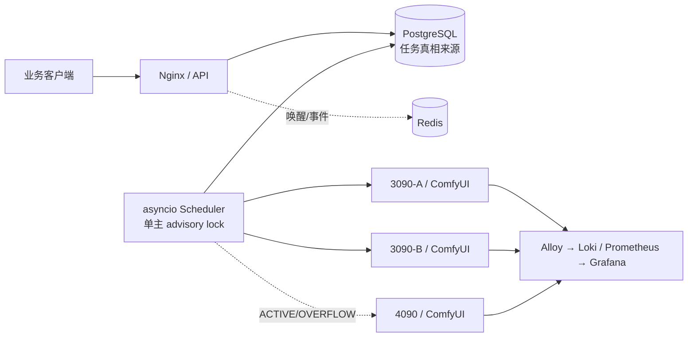

# GPU Control

> 今天部署请先打开 [文档总入口](docs/00_START_HERE.md)，再按 [三机当天部署手册](docs/28_TODAY_DEPLOYMENT_MANUAL.md) 和 [现场勾选表](docs/30_TODAY_ONSITE_CHECKLIST.md) 执行。单文件离线版位于仓库根目录 `GPU_CONTROL_成品部署联调与核心逻辑手册.pdf`。

面向两台 RTX 3090 工作节点和一台 RTX 4090 控制中心的 ComfyUI 任务调度、运维与可观测平台。

当前版本：`1.1.0-deploy-candidate`。部署阻塞项、统一镜像、节点启停、动态溢出、工作流兼容和当天部署流程已补齐；Windows 无 GPU 测试通过，真实 Ubuntu/NVIDIA、Compose 与生产工作流按现场手册验收。



正常时只有 3090-A、3090-B 执行任务；4090 默认为 `RESERVED` 并承载控制面。管理员可切换 `ACTIVE`，或启用 `OVERFLOW`，但仍需队列阈值、等待时长、哨兵文件、利用率、显存和允许时段全部通过。每个 ComfyUI 只保留一个本系统任务。

## 组件

| 组件 | 职责 |
|---|---|
| FastAPI | API Key、JWT/RBAC、任务/工作流/管理 API、SSE、幂等与配额 |
| PostgreSQL | 任务、事件、尝试、租约、节点、审计、回调的唯一持久真相 |
| asyncio scheduler | `SKIP LOCKED` 领取、公平队列、节点选择、执行、恢复与回调 |
| Redis | 非持久唤醒、实时事件和限流；中断不会丢任务 |
| ComfyUI client/Fake | 上传、提交、WS、历史、下载、取消、释放模型；无 GPU 可测 |
| Vue 3 管理台 | LiClick 风格总览、任务、节点、工作流、客户、策略、日志和审计 |
| Alloy/Loki/Grafana | 三机日志集中、指标、仪表盘与告警 |
| Node Agent / `gpuctl` | HMAC 受限运维与统一启动器；不挂 Docker Socket |

## 5 分钟无 GPU 开发验证

Python 3.11/3.12 与 Node 22：

```bash
python -m venv .venv
source .venv/bin/activate
pip install -e ".[dev,load]"
pytest -q
uvicorn tests.fake_comfyui.app:create_app --factory --port 8188
```

另开终端验证 `curl http://127.0.0.1:8188/system_stats`。前端：

```bash
cd apps/web
npm ci
npm run test
npm run dev
```

Windows PowerShell 使用 `.\.venv\Scripts\python.exe -m pytest -q`。完整本地服务链见 [负载测试](docs/21_LOAD_TEST_AND_CAPACITY.md)。

需要审阅真实渲染的管理台时，可用 `scripts/seed_demo.py` 向单独的 SQLite 库写入明确标记的演示数据，再用同一个 `DATABASE_URL` 启动 API。该脚本拒绝 PostgreSQL URL，不会写入生产库，也不会伪造真实工作流或模型。

今天直接部署请只读 [三机当天部署与联调手册](docs/28_TODAY_DEPLOYMENT_MANUAL.md)；成品功能、算法和测试证据见 [成品报告](docs/29_PRODUCT_RELEASE_AND_TEST_REPORT.md)。旧的分章节文档保留作深入参考。

单文件可打印版本：[成品部署、联调与核心逻辑 PDF](GPU_CONTROL_成品部署联调与核心逻辑手册.pdf)。

## 从空服务器开始

先读 [准备清单](docs/04_PREPARATION_CHECKLIST.md)，再依次执行 [4090 安装](docs/05_CONTROL_4090_INSTALL.md)、[3090 安装](docs/06_WORKER_3090_INSTALL.md)、[首次部署](docs/11_FIRST_DEPLOYMENT.md)。不要先手工安装 ComfyUI，也不要使用 `docker commit`。

常用命令：

```bash
scripts/gpuctl doctor
scripts/gpuctl comfy build
scripts/gpuctl deploy control
GPU_CONTROL_ROLE=node scripts/gpuctl deploy node
scripts/gpuctl comfy status
scripts/gpuctl comfy logs
scripts/gpuctl models sync --host 192.168.10.11 --dry-run
scripts/gpuctl diagnostics job JOB_ID
make verify
```

## 文档

- [架构与网络](docs/02_ARCHITECTURE.md) · [端口](docs/03_NETWORK_AND_PORTS.md)
- [镜像构建](docs/07_COMFYUI_IMAGE_BUILD.md) · [镜像分发](docs/08_IMAGE_DISTRIBUTION.md) · [模型同步](docs/09_MODEL_SYNC.md)
- [工作流接入](docs/10_WORKFLOW_ONBOARDING.md) · [管理台](docs/12_WEB_ADMIN_GUIDE.md) · [公共 API](docs/13_PUBLIC_API_GUIDE.md)
- [调度设计](docs/14_SCHEDULER_DESIGN.md) · [日志排错](docs/15_LOGGING_AND_TROUBLESHOOTING.md) · [监控飞书](docs/16_MONITORING_AND_FEISHU.md)
- [备份恢复](docs/17_BACKUP_AND_RESTORE.md) · [升级回滚](docs/18_UPGRADE_AND_ROLLBACK.md) · [安全](docs/19_SECURITY.md) · [故障手册](docs/20_FAILURE_RUNBOOK.md)
- [验收清单](docs/23_ACCEPTANCE_CHECKLIST.md) · [仍需提供的材料](docs/USER_INPUT_REQUIRED.md) · [实施状态](docs/IMPLEMENTATION_STATUS.md)
