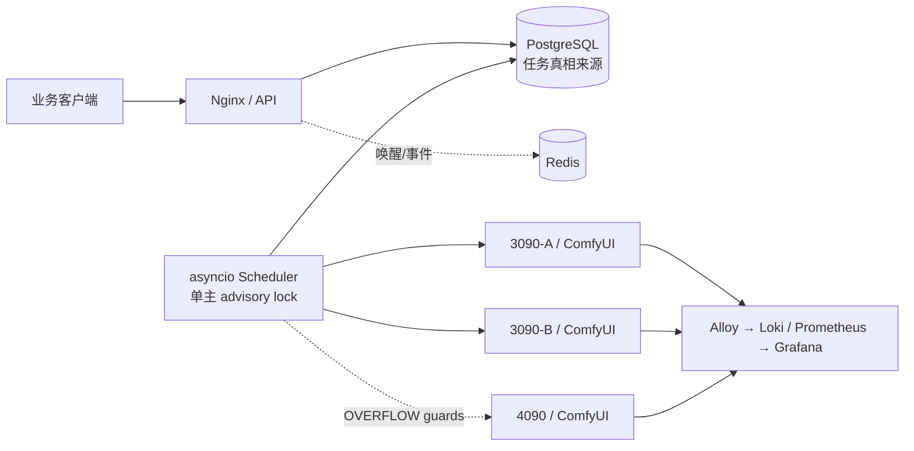

# 统一调度中心（GPU Control）

> 今天部署请先打开 [文档总入口](docs/00_START_HERE.md)，再按 [三机当天部署手册](docs/28_TODAY_DEPLOYMENT_MANUAL.md) 和 [现场勾选表](docs/30_TODAY_ONSITE_CHECKLIST.md) 执行。单文件离线版位于仓库根目录 `GPU_CONTROL_成品部署联调与核心逻辑手册.pdf`。

面向两台 RTX 3090 工作节点和一台 RTX 4090 控制中心的统一任务调度、运维与可观测平台；GPU
推理平面负责 ComfyUI，独立 Asset Processing 平面负责 Blender CPU 资产任务。

生产在线版本：`1.5.7`，控制面镜像统一绑定源码
`11844e7f2ff5ea33db7e073b3f2af5c03b22085a`，最后核验的生产数据库修订为
`20260730_0011`。当前发布状态为 `DEPLOYED_NOT_ACCEPTED`：四个控制面服务已在零活动任务窗口完成
热更新并通过健康、版本和单主锁核对，但固定 B 系列速度基准、完整故障注入、registry/SBOM 证据及
连续七天观察尚未全部完成，不能写成 `FROZEN` 或 `PRODUCTION_ACCEPTED`。三机 ComfyUI 固定镜像仍为
`projects-0.2.3`。GPU 推理平面继续提供三机图片 API 与分布式序列帧调度；独立 CPU Asset
平面提供 Blender PBR UV、AI 重拓扑和 Windows Substance 烘焙 API。当前生产配置
`RETOPOLOGY_QA_ENFORCEMENT=advisory`：几何质量不达标会保留告警和诊断报告，但通过输入身份、
manifest、文件完整性与 SHA 硬门禁的 BLEND/FBX 仍以正式 `blend`/`fbx` 交付；源文件保护与
完整性失败仍拒绝交付。两个平面使用独立队列与租约，生产任务优先于测试任务。

`1.5.7` 已修复 PBR 的 3090-B 下一轮预约续租；Windows Baker v3 保持 ComfyUI 进程且不主动调用
`/free` 清缓存，并在 WebUI 展示真实等待原因。零任务滚动发布后，单次合成 PBR canary 已以正式
12 项 artifact、逐件 SHA 和容器连续性证据通过；设计边界、发布证据与回滚门禁见
`docs/77_2026-08-03_PBR_NEXT_TURN_AND_COMFY_CACHE_RETENTION_1_5_7.md`。

`1.5.8` 当前仅为源码候选，尚未迁移或部署。它收紧 Substance 租约恢复的宿主进程/后续 ComfyUI
心跳证据，增加 Windows Agent 单实例锁和 Worker nonce 防重放，并统一 Codex 新鲜度门禁与 Web 展示。
生产任务清空并完成 drain/canary 前继续运行 1.5.7；候选验证与强制升级顺序见
`docs/80_2026-08-03_CONTROL_PLANE_1_5_8_CANDIDATE_AND_SAFE_ROLLOUT.md`。

六 API、120 VU 的独立 R8 有界压力已以退出码 0 完成：`39,778` 个 HTTP 请求、0 失败，六 API、
七项阈值、`120/120` 清场、三 GPU 饱和和 379 个连续遥测样本全部通过。该结果只验收综合有界压力，
不替代固定 B97/`3×B97`、完整故障矩阵或七天生产观察；原始证据和 SHA 见
`docs/76_2026-07-31_SIX_API_120VU_FINAL_ACCEPTANCE.md`，完整原始结果同时以 Git LFS 归档保存在
`artifacts/load-tests/sixapi-20260730-r8/`。

1.5.5 的归档规则见 `docs/68_2026-07-30_CONTROL_PLANE_1_5_5_REPRODUCIBLE_PACKAGING.md`；
1.5.6 已生成本地可校验离线归档并将两段大文件作为 Git LFS 对象同步。由于固定 SBOM generator 与
registry manifest digest 仍待补齐，该归档仍是 `CANDIDATE_ARCHIVE_ONLY`，不能把本地 image ID 或
离线 OCI identity 冒充 registry digest。部署、归档、回滚和剩余门禁统一见
`docs/75_2026-07-30_CONTROL_PLANE_1_5_6_DEPLOYMENT_AND_ARCHIVE.md`。



当前生产拓扑为 3090-A、3090-B `ONLINE/ACTIVE`，4090 `ONLINE/OVERFLOW`，合计最多 3 个受控 GPU 执行槽位。4090 仅在队列阈值、等待时长、哨兵文件、利用率、显存和允许时段等 OVERFLOW Guard 全部通过时参与推理。每个 ComfyUI 只保留一个本系统任务。

## 组件

| 组件 | 职责 |
|---|---|
| FastAPI | API Key、JWT/RBAC、任务/工作流/管理 API、SSE、幂等与配额 |
| PostgreSQL | 任务、事件、尝试、租约、节点、审计、回调的唯一持久真相 |
| asyncio scheduler | `SKIP LOCKED` 领取、公平队列、节点选择、执行、恢复与回调 |
| Redis | 非持久唤醒、实时事件和限流；中断不会丢任务 |
| ComfyUI client/Fake | 上传、提交、WS、历史、下载、取消、释放模型；无 GPU 可测 |
| Vue 3 管理台 | 动画管家对齐的任务/API 分类、真实阶段时间、性能分析、可解释调度、节点、日志和审计 |
| Alloy/Loki/Grafana | 三机日志集中、指标、仪表盘与告警 |
| Node Agent / `gpuctl` | HMAC 受限运维与统一启动器；不挂 Docker Socket |

## 5 分钟无 GPU 开发验证

Python 3.11/3.12 与 Node 22：

```bash
python -m venv .venv
source .venv/bin/activate
pip install -e ".[dev,load]"
pytest -q
uvicorn tests.fake_comfyui.app:create_app --factory --port 8188
```

另开终端验证 `curl http://127.0.0.1:8188/system_stats`。前端：

```bash
cd apps/web
npm ci
npm run test
npm run dev
```

Windows PowerShell 使用 `.\.venv\Scripts\python.exe -m pytest -q`。完整本地服务链见 [负载测试](docs/21_LOAD_TEST_AND_CAPACITY.md)。

需要审阅真实渲染的管理台时，可用 `scripts/seed_demo.py` 向单独的 SQLite 库写入明确标记的演示数据，再用同一个 `DATABASE_URL` 启动 API。该脚本拒绝 PostgreSQL URL，不会写入生产库，也不会伪造真实工作流或模型。

今天直接部署请只读 [三机当天部署与联调手册](docs/28_TODAY_DEPLOYMENT_MANUAL.md)；成品功能、算法和测试证据见 [成品报告](docs/29_PRODUCT_RELEASE_AND_TEST_REPORT.md)。旧的分章节文档保留作深入参考。

单文件可打印版本：[成品部署、联调与核心逻辑 PDF](GPU_CONTROL_成品部署联调与核心逻辑手册.pdf)。

## 从空服务器开始

先读 [准备清单](docs/04_PREPARATION_CHECKLIST.md)，再依次执行 [4090 安装](docs/05_CONTROL_4090_INSTALL.md)、[3090 安装](docs/06_WORKER_3090_INSTALL.md)、[首次部署](docs/11_FIRST_DEPLOYMENT.md)。不要先手工安装 ComfyUI，也不要使用 `docker commit`。

常用命令：

```bash
scripts/gpuctl doctor
scripts/gpuctl comfy build
scripts/gpuctl deploy control
GPU_CONTROL_ROLE=node scripts/gpuctl deploy node
scripts/gpuctl comfy status
scripts/gpuctl comfy logs
scripts/gpuctl models sync --host 192.168.10.11 --dry-run
scripts/gpuctl diagnostics job JOB_ID
make verify
```

## 文档

- [架构与网络](docs/02_ARCHITECTURE.md) · [端口](docs/03_NETWORK_AND_PORTS.md)
- [镜像构建](docs/07_COMFYUI_IMAGE_BUILD.md) · [镜像分发](docs/08_IMAGE_DISTRIBUTION.md) · [模型同步](docs/09_MODEL_SYNC.md)
- [工作流接入](docs/10_WORKFLOW_ONBOARDING.md) · [管理台](docs/12_WEB_ADMIN_GUIDE.md) · [公共 API](docs/13_PUBLIC_API_GUIDE.md) · [动画管家批量抠图 V2](docs/38_GPU_CONTROL_MATTING_HANDOFF_V2.md)
- [调度设计](docs/14_SCHEDULER_DESIGN.md) · [日志排错](docs/15_LOGGING_AND_TROUBLESHOOTING.md) · [监控飞书](docs/16_MONITORING_AND_FEISHU.md)
- [备份恢复](docs/17_BACKUP_AND_RESTORE.md) · [升级回滚](docs/18_UPGRADE_AND_ROLLBACK.md) · [安全](docs/19_SECURITY.md) · [故障手册](docs/20_FAILURE_RUNBOOK.md)
- [验收清单](docs/23_ACCEPTANCE_CHECKLIST.md) · [仍需提供的材料](docs/USER_INPUT_REQUIRED.md) · [实施状态](docs/IMPLEMENTATION_STATUS.md)
- [4090 与双项目部署实录](docs/31_2026-07-22_4090_DEPLOYMENT_RECORD.md) · [图片 API、真实任务与 Web 管理台实录](docs/32_2026-07-23_PUBLIC_IMAGE_API_AND_UI_RECORD.md) · [3090 当前接入交接](docs/33_3090_NODE_DEPLOYMENT_HANDOFF.md) · [3090-B 与三卡 10 客户验收](docs/35_2026-07-23_3090_B_AND_THREE_NODE_ACCEPTANCE.md)
- [批量抠图 1.2.0 生产部署记录](docs/39_2026-07-24_BATCH_MATTING_DEPLOYMENT_RECORD.md)
- [Asset V3：UV / 重拓扑 API 与真实两机验收](docs/55_ASSET_UV_RETOPOLOGY_V3_API_AND_LIVE_ACCEPTANCE.md)
- [3090-B Windows/WSL2 GPU 验收](docs/57_2026-07-28_3090_B_WINDOWS_WSL2_GPU_ACCEPTANCE.md) · [ModelView 粗糙度 API](docs/57_2026-07-29_MODELVIEW_ROUGHNESS_API.md)
- [Asset V4 客户端合同](docs/58_2026-07-29_ASSET_V4_CLIENT_HANDOFF_AND_STABILITY.md) · [Substance Baker API](docs/58_2026-07-29_SUBSTANCE_BAKER_API.md)
- [发布审计与稳定性记录](docs/59_2026-07-29_RELEASE_AUDIT_STABILITY_AND_IMAGE_RECORD.md) · [粗糙度与烘焙 V2 交接](docs/59_2026-07-29_ROUGHNESS_AND_SUBSTANCE_BAKER_API_HANDOFF_V2.md)
- [UV / 重拓扑 V5 交接](docs/60_2026-07-29_UV_AND_RETOPOLOGY_API_HANDOFF_V5.md) · [Baker 四槽发布](docs/61_2026-07-29_SUBSTANCE_BAKER_4_SLOT_RELEASE.md) · [可复现备份与滚动更新](docs/62_2026-07-30_REPRODUCIBLE_BACKUP_AND_ROLLING_UPDATE.md)
- [三节点发布与恢复闭环](docs/63_2026-07-30_THREE_NODE_RELEASE_AND_RECOVERY_CLOSURE.md) · [动画管家 V4.1 首轮事实回执](docs/64_2026-07-30_ASSETCLAW_GPU_CONTROL_V4_1_RECEIPT.md) · [动画管家优化后第二轮对齐回执](docs/65_2026-07-30_ASSETCLAW_POST_OPTIMIZATION_ALIGNMENT_RECEIPT.md)
- [WebUI 运行中心重构](docs/66_2026-07-30_WEBUI_OPERATIONS_REDESIGN.md) · [六 API 综合压测手册](docs/67_2026-07-30_SIX_API_MIXED_LOAD_TEST_RUNBOOK.md)
- [1.5.5 可复现打包门禁](docs/68_2026-07-30_CONTROL_PLANE_1_5_5_REPRODUCIBLE_PACKAGING.md) · [动画管家 1.5.5 速度稳定性联测前回执](docs/69_2026-07-30_ASSETCLAW_1_5_5_SPEED_STABILITY_PREJOINT_RECEIPT.md)
- [Retopology QA Advisory 热修复](docs/70_2026-07-30_RETOPOLOGY_QA_ADVISORY_HOTFIX_AND_LOAD_READINESS.md) · [Nginx 容量与控制流隔离](docs/71_2026-07-30_NGINX_GATEWAY_CAPACITY_AND_CONTROL_ISOLATION.md) · [取消与压测恢复](docs/72_2026-07-30_INTERRUPTED_CANCEL_AND_LOAD_HARNESS_RECOVERY.md) · [六 API 120 VU r5/r7 历史结果](docs/73_2026-07-30_SIX_API_120VU_LOAD_RESULT.md) · [Scheduler/Substance 稳定性热修复](docs/74_2026-07-30_SCHEDULER_AND_SUBSTANCE_STABILITY_HOTFIX.md) · [1.5.6 部署、归档与回滚证据](docs/75_2026-07-30_CONTROL_PLANE_1_5_6_DEPLOYMENT_AND_ARCHIVE.md) · [六 API 120 VU R8 最终有界压测验收](docs/76_2026-07-31_SIX_API_120VU_FINAL_ACCEPTANCE.md) · [1.5.7 PBR 下一轮与缓存保持发布记录](docs/77_2026-08-03_PBR_NEXT_TURN_AND_COMFY_CACHE_RETENTION_1_5_7.md) · [Substance 长租约与 Agent 恢复](docs/78_2026-08-03_SUBSTANCE_LONG_LEASE_AND_AGENT_RECOVERY_HOTFIX.md) · [Codex 三节点探针恢复](docs/79_2026-08-03_CODEX_PER_NODE_AUTH_AND_PROBE_RECOVERY.md) · [1.5.8 候选与安全发布](docs/80_2026-08-03_CONTROL_PLANE_1_5_8_CANDIDATE_AND_SAFE_ROLLOUT.md)
