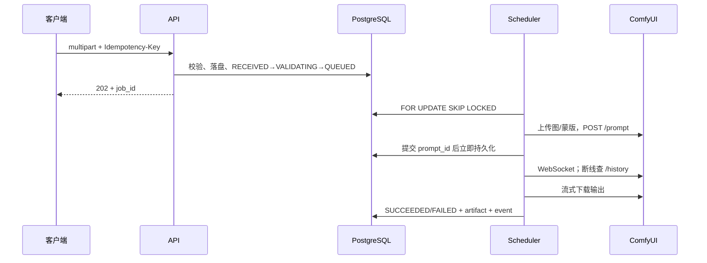
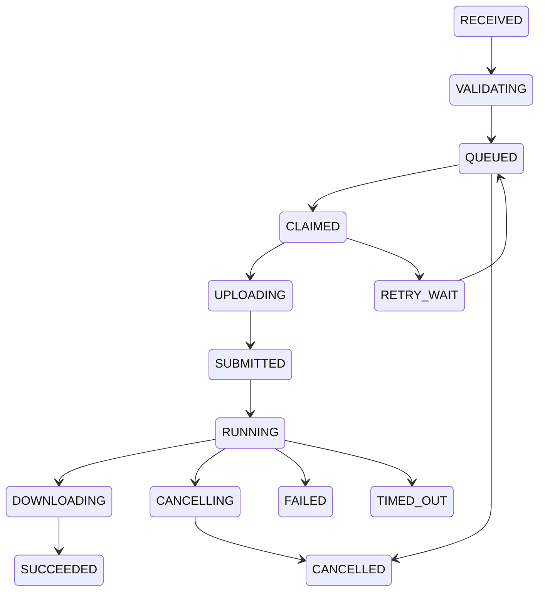

# 架构

```mermaid
sequenceDiagram
  participant C as 客户端
  participant A as API
  participant D as PostgreSQL
  participant S as Scheduler
  participant U as ComfyUI
  C->>A: multipart + Idempotency-Key
  A->>D: 校验、落盘、RECEIVED→VALIDATING→QUEUED
  A-->>C: 202 + job_id
  S->>D: FOR UPDATE SKIP LOCKED
  S->>U: 上传图/蒙版，POST /prompt
  S->>D: 提交 prompt_id 后立即持久化
  S->>U: WebSocket；断线查 /history
  S->>U: 流式下载输出
  S->>D: SUCCEEDED/FAILED + artifact + event
```

```mermaid
stateDiagram-v2
  RECEIVED --> VALIDATING
  VALIDATING --> QUEUED
  QUEUED --> CLAIMED
  CLAIMED --> UPLOADING
  UPLOADING --> SUBMITTED
  SUBMITTED --> RUNNING
  RUNNING --> DOWNLOADING
  DOWNLOADING --> SUCCEEDED
  CLAIMED --> RETRY_WAIT
  RETRY_WAIT --> QUEUED
  QUEUED --> CANCELLED
  RUNNING --> CANCELLING
  CANCELLING --> CANCELLED
  RUNNING --> FAILED
  RUNNING --> TIMED_OUT
```

PostgreSQL advisory lock 保证调度器单主；行锁与节点租约保证单槽。已获得 `prompt_id` 的恢复只查 queue/history，未知时失败并人工处理，绝不盲目重提。

