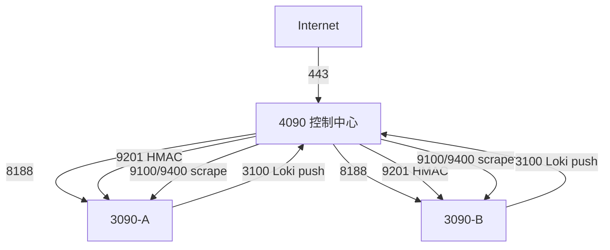

# 网络与端口

| 端口 | 来源 → 目标 | 用途 | 暴露 |
|---|---|---|---|
| 80/443 | 客户端 → 4090 | Nginx/API/Web | 仅可信网段或 HTTPS |
| 8188 | 4090 → GPU 节点 | ComfyUI | 禁止公网 |
| 9201 | 4090 → GPU 节点 | Node Agent | UFW 仅允许控制中心 |
| 9100/9400 | 4090 → 节点 | node/DCGM exporter | 禁止公网 |
| 3100 | 两台 3090 → 4090 | Alloy 推送 Loki | 仅允许两台工作节点 |
| 3000/9090/9093 | 控制中心内部 | Grafana/Prometheus/Alertmanager | 经反代或仅容器网络 |
| 5432/6379 | 控制面容器网络 | PostgreSQL/Redis | 不映射公网 |

用 `sudo ss -lntp` 核对监听，`sudo ufw status numbered` 核对来源；失败时先检查路由，再检查 UFW，再检查 Compose 网络。回滚 UFW 前保持一个已登录 SSH 会话并执行 `sudo ufw disable`。
