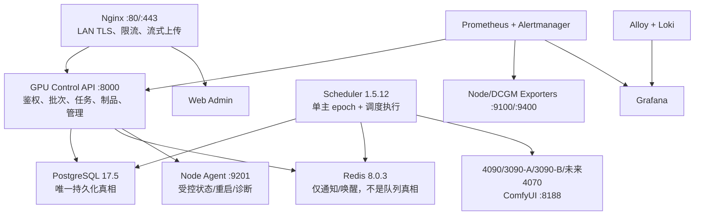
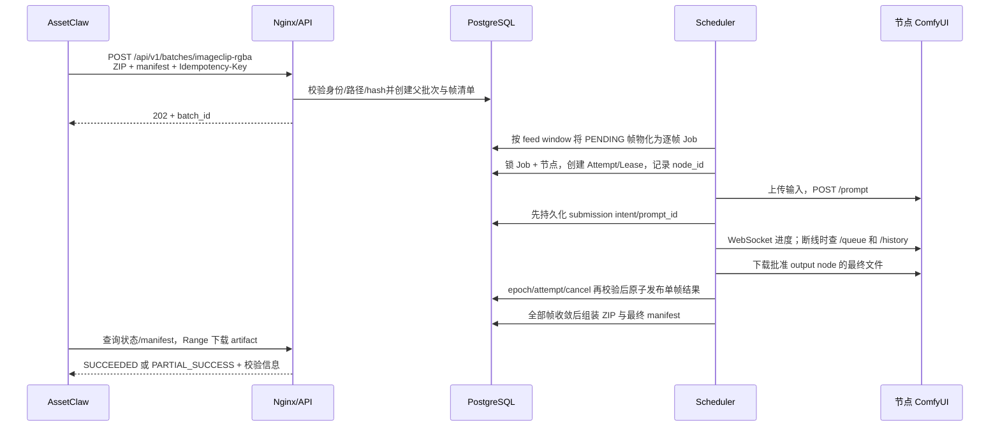
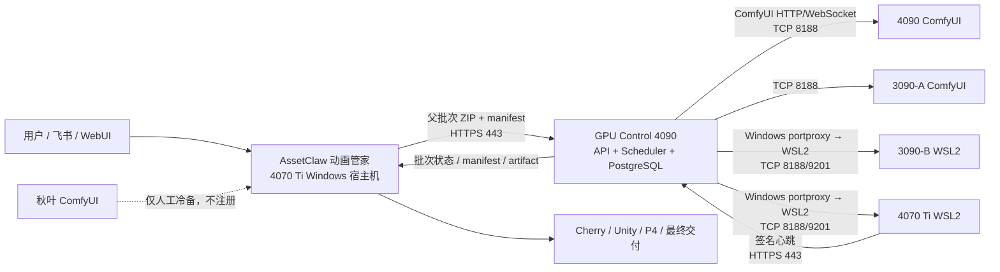

# RTX 4070 Ti Windows / WSL2 第四 GPU 节点预处理与对接手册

> 文档状态：`PREPARATION_APPROVED / PRODUCTION_NOT_APPROVED`
> 文档日期：2026-08-12
> 面向对象：4070 Ti / AssetClaw 主机维护方、GPU Control 维护方、网络管理员
> 目标主机：`DAC3OZhangqichao` / Windows 10 + WSL2 / RTX 4070 Ti 12 GB
> 建议节点 ID：`worker-4070ti-animation-host-01`
> 控制中心：`control-4090` / `10.3.34.11`
> 本文用途：先完成不影响生产的主机预处理，再由 GPU Control 团队完成第四节点交付、隔离验收和上线。

## 1. 先读结论

4070 Ti 可以按现有 3090-B 的 Windows + WSL2 模式准备为第四个 GPU 节点，但**不得按照此前草案重建一套 Worker 拉取、双向长连接或 Worker 自行上传结果的新协议**。

当前 GPU Control 的真实架构是：

1. AssetClaw 只向 4090 的统一 HTTPS API 提交父批次，不直接访问任何 GPU 节点。
2. 4090 上的 Scheduler 是唯一 GPU 调度权威，按帧生成持久化 Job 并选择节点。
3. GPU 节点内的 Node Agent 主动向 `https://10.3.34.11:443/api/v1/nodes/heartbeat` 上报身份和心跳。
4. 真正执行任务时，4090 Scheduler 主动访问目标节点的 ComfyUI `TCP 8188`。
5. 4090 的受控运维接口主动访问目标节点的 Node Agent `TCP 9201`。
6. Windows/WSL2 节点必须把稳定的 Windows 地址转发到 WSL2 当前地址；不得把动态 WSL NAT 地址登记为节点地址。
7. 每张 GPU 固定 `max_concurrency=1`。第四节点加入后是 4 个物理 GPU 槽位，不是 4070 上再运行一层业务调度器。

本次工作分成两个明确阶段：

- **现在可做：** Windows、WSL2、网络、磁盘、资源限制、TLS、端口规划和信息回执等预处理。
- **不能提前做：** 切换 AssetClaw 生产路由、注册为 ACTIVE、拉取任意 latest 镜像、复制现有密钥、修改 ImageClip 工作流或让 4070 接生产任务。

## 2. GPU Control 全集群现状

本节是 4070 对接所依赖的集群全景。数据分成“仓库真相”“线上运行真相”和“目标变更”，三者不能混为一谈。

### 2.1 版本真相

| 层级 | 2026-08-12 核验值 | 说明 |
|---|---|---|
| 当前仓库版本 | `1.5.12` | `pyproject.toml` 的应用版本 |
| 当前仓库 HEAD | `a7120a44a138d53ee0380949a2053cdebede94d9` | 包含 8 月 12 日后续资产能力改动；不等于线上 API revision |
| 线上 API | `gpu-control-api:1.5.12` | 运行 revision `093ae8b7966ae5beb86990c7881c11d4c24d4e51` |
| 线上 Scheduler | `gpu-control-scheduler:1.5.12` | 运行 revision 同为 `093ae8b...` |
| 线上 Web | `gpu-control-web:1.5.11-retopo-direct-v2` | 运行 revision `07414f496c1b58cd6e258fc8f2de61cd16f51aa9` |
| 线上 ComfyUI 镜像 tag | `registry.local:5000/gpu-control/comfyui:projects-0.2.3` | 正式 4070 交付仍需回填完整 digest |
| ComfyUI 基线 | `0.28.0` / commit `700821e1364eaab0e8f21c538a2131719fec57bf` | 三个既有节点批准基线 |
| Python / PyTorch / CUDA | `3.11.13` / `2.7.1` / `12.8.1` | 容器运行时基线 |
| 原 4070 草案基线 | `1.5.10@d504a820...` | 已落后，不能作为本次实际开发或部署基线 |

第四节点适配应从当前仓库 HEAD 开发，经过测试后构建新的不可变候选版本；不能把未提交工作区直接同步给 4070，也不能用旧 `1.5.10` 覆盖当前线上 `1.5.12`。

### 2.2 当前三台物理 GPU 节点

以下为 2026-08-12 15:08（Asia/Singapore）只读运行快照；运行负载和剩余显存会变化，地址、角色和物理身份是接入基线。

| 节点 | 地址 | 操作系统形态 | GPU | 调度池 / 当时模式 | 健康 | 槽位 | 对外执行地址 |
|---|---|---|---|---|---|---:|---|
| `control-4090` | `10.3.34.11` | Linux + Docker | RTX 4090 24 GB | `OVERFLOW / ACTIVE` | `ONLINE` | 1 | `http://10.3.34.11:8188` |
| `worker-3090-a` | `10.3.34.12` | Linux + Docker | RTX 3090 24 GB | `PRIMARY / ACTIVE` | `ONLINE` | 1 | `http://10.3.34.12:8188` |
| `worker-3090-b` | `10.3.34.14` | Windows + WSL2 Ubuntu + Docker | RTX 3090 24 GB | `PRIMARY / ACTIVE` | `ONLINE` | 1 | `http://10.3.34.14:8188` |

快照时三台节点均 `current_jobs=0`。当时数据库报告的总显存分别约为 24564/24576/24576 MiB。剩余显存不是固定容量证明，只用于实时排障和溢出保护。

既有 Worker 的批准物理身份：

| 节点 | hostname | 物理 MAC | GPU UUID |
|---|---|---|---|
| `worker-3090-a` | `lilithgames1` | `18:c0:4d:9f:13:13` | `GPU-9f116ee8-a845-c3a3-b10d-fdd6a9f8cc6c` |
| `worker-3090-b` | `worker-3090-b-wsl`（WSL 运行时名） | `3c:7c:3f:a5:b0:4f`（当前批准清单） | `GPU-092a5184-5857-d196-5df2-efa9503368aa` |

早期 3090-B 设计文档曾记录另一块 MAC `2c:f0:5d:76:7b:70`，不能把历史值当作当前身份真相；生产应以当前批准清单和签名心跳为准。4070 也必须避免出现这种历史值与现状混用。

### 2.3 加入 4070 后的目标节点表

| 节点 | 地址 | GPU | 池 | 初始模式 | 最大并发 | 生产资格 |
|---|---|---|---|---|---:|---|
| `control-4090` | `10.3.34.11` | RTX 4090 24 GB | `OVERFLOW` | 保持现状 | 1 | 已有生产节点 |
| `worker-3090-a` | `10.3.34.12` | RTX 3090 24 GB | `PRIMARY` | `ACTIVE` | 1 | 已有生产节点 |
| `worker-3090-b` | `10.3.34.14` | RTX 3090 24 GB | `PRIMARY` | `ACTIVE` | 1 | 已有生产节点 |
| `worker-4070ti-animation-host-01` | `10.3.34.238`（待 DHCP 保留） | RTX 4070 Ti 12 GB | `PRIMARY`（通过 canary 后） | `DISABLED` | 1 | 受 12 GB 兼容门禁阻断 |

第四节点不是替代节点。任何接入失败都应只禁用 4070，原三节点继续运行。

### 2.4 4090 控制面的组件与职责



| 组件 | 当前作用 | 生产原则 |
|---|---|---|
| Nginx | 统一 LAN 入口、TLS、API/心跳独立限流、大批次流式代理 | 客户端只接触 80/443；生产使用 443 |
| API | API Key/JWT 鉴权、幂等、批次/Job/制品/取消、节点管理 | 不直接执行 GPU 工作流 |
| Scheduler | 选择节点、创建 Attempt/Lease、调用 ComfyUI、下载并发布结果 | PostgreSQL advisory lock 保证单主 |
| PostgreSQL | Job、Batch、Item、Attempt、Lease、Node、审计和状态机 | 唯一队列与状态真相 |
| Redis | 调度唤醒与通知 | Redis 中断只增加扫描延迟，不丢持久状态 |
| Web Admin | 节点、任务、调度、资源和日志运维视图 | 管理面，不是业务提交入口 |
| Prometheus/DCGM/Node Exporter | 节点、GPU、应用和队列指标 | 4070 必须增加独立 targets/告警 |
| Alloy/Loki/Grafana/Alertmanager | 日志聚合、仪表盘和告警 | 日志按 node/job/batch 关联 |
| Node Agent | 节点身份心跳、GPU/系统指标、有限白名单运维 | 不领取 GPU Job，不暴露 Docker API |
| ComfyUI | 每张 GPU 一个受控执行端 | 不作为用户或 AssetClaw 直接入口 |

架构决策保持：无 Kubernetes、无 Celery；PostgreSQL 是队列，Redis 只做通知；每张物理 GPU 对应一个生产 ComfyUI 实例和一个 GPU 槽位。

### 2.5 控制面与数据面的完整数据流



重要边界：父批次 ZIP 只上传到 4090；4070 不接收 AssetClaw 的父批次，也不理解动画业务。4090 Scheduler 将单帧输入传给被选中的 ComfyUI，并把最终文件下载回 4090 存储后汇总。

### 2.6 批次与 Job 状态

父批次状态：

```text
VALIDATING → QUEUED → RUNNING → ASSEMBLING
                              ├→ SUCCEEDED
                              ├→ PARTIAL_SUCCESS
                              ├→ FAILED
                              └→ CANCELLING → CANCELLED
```

单帧 Job 状态：

```text
RECEIVED → VALIDATING → QUEUED → CLAIMED → UPLOADING
→ SUBMITTED → RUNNING → DOWNLOADING → SUCCEEDED
                         ├→ RETRY_WAIT → QUEUED
                         ├→ CANCELLING → CANCELLED
                         ├→ TIMED_OUT
                         └→ FAILED
```

当前批次实现支持 `PARTIAL_SUCCESS`，返回精确 failed items；`failure_policy=all_or_nothing` 表示一个 generation 的正式完整发布要求，不应被解释为抹掉部分成功诊断信息。由 AssetClaw 发起的失败帧 repair generation 属于客户端业务编排，不应改成 Worker 自己重写父批次。

### 2.7 当前调度规则

1. 先排除 `DISABLED/RESERVED/DRAINING`、非 ONLINE、心跳过期、槽位满、外部 GPU busy、foreign Comfy queue、人工预留和工作流不兼容节点。
2. `PRIMARY` 节点排在 `OVERFLOW` 节点之前；当前主要由两台 3090 承载普通工作。
3. 同一层内优先保持 `warm_workflow` 缓存亲和，再按最久未分配和 node ID 稳定排序。
4. 节点和 Job 在同一数据库事务中加锁，创建唯一 Attempt/Lease，避免双重领取。
5. 批次不是静态三等分或四等分；每帧是独立 Job，空闲兼容节点持续领取窗口内任务。
6. 重试帧避开已经执行过该帧的物理节点，防止同一坏节点吃光重试次数。
7. 4090 即使处于 OVERFLOW 池，在当前 `ACTIVE` 模式下也是 Primary 之后的兼容容量；若恢复严格自动溢出模式，还会检查队列阈值、时间窗口、利用率、空闲显存和 sentinel。
8. 每个 GPU 节点 `max_concurrency=1`，因此现有最大 GPU prompt 并发为 3；4070 通过准入后为 4。

这套逐帧动态领取已经具备负载自然分散和尾部补位能力，不需要为 4070 新造 Worker pull、work stealing 或子任务上传协议。

### 2.8 心跳、健康与恢复

- Node Agent 默认按当前生产配置每 5 秒向 4090 HTTPS 发送一次签名心跳。
- Scheduler 的节点心跳超时门槛当前为 20 秒。
- Scheduler 另有约 5 秒健康刷新，读取 ComfyUI `/system_stats`、队列和 GPU/系统探针。
- Node Agent 心跳只证明身份通道可用；ComfyUI 不健康、管线不匹配或显存不足仍会阻止调度。
- Scheduler 使用持久化 leader epoch 隔离旧主；每次关键状态写入重新校验 epoch。
- 已取得 `prompt_id` 的任务在重启恢复时查询 ComfyUI queue/history，找不到时 fail closed，不盲目重复提交。
- 下载使用私有 staging；发布前重检 expected prompt、attempt、取消意图和 epoch，迟到执行不能覆盖新 attempt 或已取消结果。
- DRAINING 会停止新分配；生产变更必须等活动 Job 和 `current_jobs` 清零。

NodeLease 当前是 4090 内部 30 分钟默认执行占位记录；它不等同于草案里的 Worker 续租协议。真正超时还受工作流 timeout（ImageClip 1800 秒等）和 Scheduler watchdog 管理。

### 2.9 当前 GPU 工作流清单

| workflow | 版本 | min VRAM | timeout | 最终输出节点 | 4070 初始结论 |
|---|---|---:|---:|---|---|
| `imageclip-rgba` | `2026.07.30-691770c-r1` | 22000 MiB | 1800 s | `25` / SaveImage #25 | 12 GB 不兼容，待原工作流 canary |
| `modelview-inpaint` | `2026.07.27-8c37f07-seedvr2` | 22000 MiB | 2400 s | `9` | 12 GB 不兼容；本次不要求接入 |
| `modelview-roughness` | `2026.07.29-d318bb39-roughness-v1` | 22000 MiB | 1800 s | `355` | 12 GB 不兼容；本次不要求接入 |

4070 本次业务目标只有 `imageclip-rgba`。即使节点上线，也不能因为同属 GPU 节点而自动声明支持 ModelView 工作流；兼容性按每个 workflow version 独立计算。

### 2.10 API 与调用边界

AssetClaw 使用的核心公开接口：

| 接口 | 用途 |
|---|---|
| `POST /api/v1/batches/imageclip-rgba` | 提交不可变父批次 |
| `GET /api/v1/batches/{batch_id}` | 查询批次与进度 |
| `GET /api/v1/batches/{batch_id}/manifest` | 查询逐帧状态、节点、hash 与失败项 |
| `GET /api/v1/batches/{batch_id}/events` | SSE 状态事件 |
| `GET /api/v1/batches/{batch_id}/artifacts/{artifact_id}` | 下载结果包，支持 Range |
| `POST /api/v1/batches/{batch_id}/cancel` | 持久化取消请求 |
| `GET /api/v1/scheduler/capacity` | 租户安全的建议容量快照 |
| `GET /health/live`、`GET /health/ready` | 入口健康检查 |

GPU 节点的 8188/9201 是内部执行和运维接口，AssetClaw 不调用。`/scheduler/capacity` 当前公开聚合节点数、槽位和兼容节点数，不暴露硬件身份或内网地址；详细节点信息只在管理面查看。

### 2.11 存储、模型与制品

| 位置 | 内容 | 所有权/策略 |
|---|---|---|
| 4090 `/srv/gpu-control/jobs` | Job 输入、执行记录、下载 staging、最终单任务制品 | GPU Control 管理 |
| 4090 批次目录 | 原始批次、manifest、逐帧结果和汇总 ZIP | GPU Control 管理，原子发布 |
| 各节点 `/srv/comfyui/runtime` | ComfyUI input/output/temp/user | 固定容器 UID 可写，短期运行数据 |
| 各节点 `/opt/imageclip/models` | ImageClip 模型 | 容器只读挂载，按 SHA 清单同步 |
| 各节点 `/opt/imageclip` | 批准业务仓库副本 | 只读同步批准 commit，不在 GPU Control 任务中修改 |
| Registry | 批准的 ComfyUI 镜像 | 使用 digest 验证，禁止 latest |

输入上传、Comfy 输出下载和批次组装都以 4090 为中心。现架构没有 Worker 直连对象存储或预签名上传；不要把草案里的对象存储协议写入 4070 安装步骤。

### 2.12 可观测性与告警

当前集群采集：

- API/Scheduler 请求、队列、调度和执行指标。
- Node Exporter 的 CPU、内存、磁盘与系统指标。
- DCGM Exporter 的 GPU 利用率、显存、温度和功耗。
- Node Agent 的身份、GPU/系统深度探针。
- Docker 和 systemd 日志经 Alloy 进入 Loki，在 Grafana 查询。
- Alertmanager 处理节点不健康、WSL 抖动、内存压力、GPU 高温和性能异常等告警。

现有 WSL 专项告警的 node ID 写死 `worker-3090-b`，在 4070 上线前必须泛化或增加 4070 规则；不能因为 4070 显示 ONLINE 就认为监控已完成。

### 2.13 安全模型

- 业务客户端使用独立 API Key；Node Agent 使用逐节点 HMAC；两者不可复用。
- API Key 只保存 hash，Node Agent 请求带时间戳、nonce 和 HMAC，防重放。
- 4070 的 HMAC 必须是第四个独立 secret；当前代码若找不到专用字段会回退共享 secret，因此必须先完成代码适配。
- 主控与客户端通过 LAN CA 验证 TLS；节点内部 8188/9201 依赖可信内网和源 IP 防火墙收敛。
- Node Agent 只允许 status/start/stop/restart/logs/nvidia-smi/system/diagnostics 白名单操作，通过受限 sudo 脚本执行。
- Docker socket 不暴露给控制面；TCP 2375 明确禁止。
- 4090 不获得 4070 Windows 管理员、AssetClaw、P4、Unity 或秋叶 ComfyUI 控制权。
- 所有外部管线 Git、工作流、模型、提示词和输出语义保持只读 ownership boundary。

### 2.14 当前四节点扩容的代码缺口总览

| 范围 | 当前状态 | 4070 上线前动作 |
|---|---|---|
| Node/Lease/Attempt 数据模型 | 节点数量通用 | 无需重构协议 |
| 调度排序与兼容性 | 节点数量通用 | 增加 4070 后回归四节点并发 |
| 批次逐帧动态分发 | 已实现 | 直接复用 |
| 节点 bootstrap inventory | 写死恰好三节点 | 扩展并增加测试 |
| env 生成器 | 只生成三节点 | 生成 4070 env 与专用 HMAC |
| Settings 专用 HMAC | 只列三节点 | 增加 4070 配置，禁止共享回退 |
| Web 节点排序/部分文案 | 写死三节点 | 增加 4070，未知节点排序也要稳定 |
| Prometheus targets/WSL 告警 | 两 Worker/3090-B 写死 | 增加 4070 targets 与 WSL 告警 |
| smoke/load harness | 部分写死三节点 | 新增四节点场景，保留历史三节点场景 |
| 4070 网络 | 尚未部署 | 复用 3090-B portproxy + watchdog 模式 |
| 4070 工作流兼容性 | 12 GB < 22 GB | 保持阻断，做原工作流隔离 canary |

结论：第四节点接入是一次可控的“现有架构扩容 + WSL2 节点复制 + 异构显存准入”，不是调度协议重写。

## 3. 当前阻断项：12 GB 显存不等于已具备抠图资格

当前批准的 `imageclip-rgba` 工作流身份为：

| 字段 | 当前批准值 |
|---|---|
| `workflow_key` | `imageclip-rgba` |
| `workflow_version` | `2026.07.30-691770c-r1` |
| `pipeline_commit` | `691770cd6a59fd7c51391456fe900dc57a313233` |
| `pipeline_sha256` | `00e7104762f0a1fdf3a4c20e043bec2b9f088132452d5a5ce4302ba268edac0b` |
| `output_node` | `SaveImage #25` |
| GPU Control `min_vram_mb` | `22000` |

4070 Ti 实际显存约 `12282 MiB`，低于当前 `22000 MiB` 兼容门槛。现有调度器会正确地把该节点判为不兼容。因此：

- 环境安装成功不代表可以接生产。
- 不能通过修改模型、采样参数、分辨率、工作流节点、提示词或输出节点来迁就 12 GB 显存。
- 不能删掉显存门槛后直接上线。
- GPU Control 团队只能使用**完全相同且已批准的工作流、模型和输出语义**做隔离 canary。
- 只有在 1/6/30 帧及长稳实测证明 12 GB 可稳定运行、显存峰值有余量且无持续 OOM 后，才可审核调整 GPU Control 自己的兼容性元数据。
- 如果原工作流在 12 GB 上不能稳定运行，4070 必须保持 `DISABLED/DRAINING`，不能用预览、中间结果或降质结果代替正式输出。

这项判定属于 GPU Control 的生产准入，不要求 4070 主机维护方现在解决。

## 4. 目标架构



### 3.1 权限与责任边界

| 范围 | 权威方 | 说明 |
|---|---|---|
| 动画业务、飞书/WebUI、拆帧、后处理、Unity、P4、交付 | AssetClaw | 仍在 Windows 业务面运行 |
| GPU 队列、节点选择、重试、取消、批次状态、制品汇总 | GPU Control | 仍由 4090 统一负责 |
| ComfyUI 工作流、模型、节点参数和输出语义 | 外部业务管线 | 只同步批准版本，不由本次接入修改 |
| 4070 Windows/WSL 基础运维 | 4070 主机维护方主责 | GPU Control 提供锁定交付包和验收标准 |
| Node Agent、节点身份、兼容性、调度准入 | GPU Control | 4070 侧不得自行伪造或复用身份 |
| 秋叶 ComfyUI | AssetClaw 人工冷备 | 不注册、不开放给 4090、不自动回退 |

## 5. 现有协议，而不是新协议

### 4.1 Node Agent 心跳

Node Agent 每 5 秒左右向 4090 的 HTTPS 入口发送 HMAC 签名心跳。当前心跳内容包括：

- `node_id`
- Windows 稳定 IPv4 地址（通过 `NODE_ADVERTISE_IP` 明确配置）
- 物理 MAC
- GPU UUID 与 GPU 型号
- hostname
- Node Agent 版本与 GPU Control source revision
- ImageClip commit 与 pipeline SHA

4090 校验：

- 节点必须已由管理员预批准；未知 `node_id` 返回 `NODE_NOT_APPROVED`。
- MAC/GPU UUID 必须与登记身份一致。
- 反向代理看到的来源 IP 必须与心跳上报 IP 一致。
- HMAC 时间戳、nonce 和签名必须有效。
- 心跳通过后，控制面将节点执行地址设为 `http://<Windows稳定IP>:8188`，管理地址设为 `http://<Windows稳定IP>:9201`。

当前心跳响应只是确认接收及返回节点地址，不包含草案设想的租约续期、命令队列、controller epoch 回执或双向流。4070 接入不应把这些未实现能力写成上线前提。

### 4.2 GPU Job 与租约

GPU Job、Attempt、NodeLease 和 Scheduler epoch 均由 4090 持久化。节点不是拉取型 Worker：

- Scheduler 在 PostgreSQL 中领取 Job、占用节点槽位并记录 Attempt/Lease。
- Scheduler 使用 `ComfyClient(node.base_url)` 上传输入、提交 `/prompt`、监听 WebSocket、查询 `/history` 并下载输出。
- 成功结果先进入 4090 私有 staging，重新检查 attempt、取消和 scheduler epoch 后再原子发布。
- 批次按帧物化，`BATCH_FEED_WINDOW` 控制在途窗口；不同帧可以动态分布到不同节点。
- 失败帧重试会避开已经尝试过的物理节点。

现有 `NodeLease` 是 4090 内部调度记录，并不是 Worker 端可续租协议。后续若要演进为 Worker 拉取，应另立项目、数据模型和迁移计划，不能与本次第四节点扩容混做。

## 6. 网络合同

### 5.1 固定身份

| 项目 | 目标值 |
|---|---|
| Windows hostname | `DAC3OZhangqichao` |
| GPU Control node ID | `worker-4070ti-animation-host-01` |
| Windows IPv4 | 优先保留 `10.3.34.238/24` |
| 物理 MAC | `34:5a:60:47:c6:1d` |
| GPU UUID | `GPU-70c028e4-dd91-4337-8f96-29daa437d1c3` |
| 控制中心 | `10.3.34.11` |
| 初始 GPU 并发 | `1` |
| 初始节点模式 | `DISABLED` 或 `DRAINING`，绝非 `ACTIVE` |

节点身份由 `node_id + 独立HMAC凭证 + 物理MAC + GPU UUID + 管线身份` 共同建立。IP 用于路由和 ACL，但不是唯一身份；WSL 的 `172.x/20.x` 地址不得登记为节点地址。

### 5.2 必需连接矩阵

| 来源 | 目标 | 端口 | 方向 | 用途 | 预处理阶段 |
|---|---|---:|---|---|---|
| AssetClaw Windows | `10.3.34.11` | 443/TCP | 出站 | 业务 API、批次、制品 | 可验证 TLS |
| 4070 WSL Node Agent | `10.3.34.11` | 443/TCP | 出站 | 签名心跳 | 安装 Agent 后启用 |
| 4090 | `10.3.34.238` | 8188/TCP | 入站至 Windows，再转 WSL | ComfyUI 任务执行 | 端口转发由正式脚本配置 |
| 4090 | `10.3.34.238` | 9201/TCP | 入站至 Windows，再转 WSL | Node Agent 健康与受控操作 | 端口转发由正式脚本配置 |
| 4090 | `10.3.34.238` | 9100/TCP | 入站至 Windows，再转 WSL | Node Exporter | 监控交付时配置 |
| 4090 | `10.3.34.238` | 9400/TCP | 入站至 Windows，再转 WSL | DCGM Exporter | 监控交付时配置 |
| 运维来源 | `10.3.34.238` | 2222/TCP | 入站至 Windows，再转 WSL 22 | WSL 专用账户 SSH | 仅批准运维来源 |

禁止项：

- 禁止开放 Docker TCP `2375`。
- 禁止把 8188/9201/9100/9400 开给整个 LAN 或公网；来源限定为 `10.3.34.11`。
- 禁止给 4090 Windows 管理员密码、P4/Unity/AssetClaw 凭证或任意 Windows Shell 权限。
- 禁止把秋叶 ComfyUI 的 8188 作为集群地址。
- 禁止把 WSL 当前 NAT IP 写死进 GPU Control 数据库。

## 7. 4070 主机维护方现在执行的预处理

本节操作不得修改秋叶 ComfyUI、AssetClaw、P4、Unity 或任何业务工作流。

### 7.0 2026-08-12 已完成的主机级预检

根据 4070 主机侧提供的预检结果，以下项目已完成，可在最终回执中直接引用，但仍应保留原始命令输出作为证据：

| 项目 | 已核验结果 | 状态 |
|---|---|---|
| WSL 应用版本 | `2.7.11.0` | 已完成 |
| WSL Linux Kernel | `6.18.33.2-2` | 已完成 |
| WSL 默认版本 | `2` | 已完成 |
| Virtual Machine Platform / Hypervisor | 正常 | 已完成 |
| GPU | RTX 4070 Ti，GPU UUID 已核对 | 已完成 |
| Windows NVIDIA 驱动 | `576.52` | 已完成 |
| 物理 MAC | `34-5A-60-47-C6-1D` | 已完成 |
| 当前 IPv4 | `10.3.34.238/24` | 已完成；DHCP Reservation 仍需网络管理员确认 |
| 到主控 | `10.3.34.11:443` 直连成功 | 已完成 |
| GPU Control | 健康、PostgreSQL、Redis 正常 | 已完成，只读核验 |
| GPU Control 版本 | `1.5.12` | 已完成；原草案 `1.5.10` 已废止 |
| 当前兼容容量 | 3 个节点、3 个空闲 slot | 已完成，属于当时快照 |
| Windows C 盘空闲 | `376.9 GiB` | 已完成；仍需确认 WSL VHDX/模型/Docker 配额 |
| AssetClaw Gateway / WebUI | HTTP 200 | 已完成 |

这些证据证明 Windows/WSL 平台和到主控的基础网络已就绪，但**尚未证明**以下生产前提：Ubuntu 22.04 发行版及 systemd、锁定 Docker/containerd、NVIDIA Container Toolkit、容器内 GPU UUID、模型与镜像 digest、8188/9201 端口转发、自恢复、Node Agent 身份心跳以及 12 GB 原工作流 canary。

### 7.1 变更前记录

在管理员 PowerShell 中创建一份非敏感验收记录：

```powershell
$Record = Join-Path $env:USERPROFILE "Desktop\gpu-control-4070-preflight.txt"
@(
  "CollectedAt=$((Get-Date).ToUniversalTime().ToString('o'))"
  "ComputerName=$env:COMPUTERNAME"
  (Get-ComputerInfo | Select-Object WindowsProductName, WindowsVersion, OsBuildNumber | Out-String)
  (Get-NetIPConfiguration | Out-String)
  (Get-NetAdapter | Select-Object Name, InterfaceDescription, Status, MacAddress, LinkSpeed | Out-String)
  (nvidia-smi.exe -L | Out-String)
  (nvidia-smi.exe | Out-String)
) | Set-Content -Encoding UTF8 $Record
```

不要把 `.env`、API Key、HMAC Secret、Windows 密码或私钥写入该记录。

### 7.2 完成 Windows 重启并验证 WSL 前置功能

此前 WSL 与 VirtualMachinePlatform 的 DISM 返回 `3010`，必须人工重启才能生效。重启后执行：

```powershell
wsl.exe --version
wsl.exe --status
wsl.exe --set-default-version 2
wsl.exe --list --verbose
nvidia-smi.exe -L
```

通过条件：

- `wsl --version` 可输出 WSL 和 Kernel 版本，而不是旧帮助页。
- 默认版本是 2。
- 不出现虚拟机平台或 Kernel 缺失错误。
- Windows 仍识别唯一目标 GPU UUID。
- 秋叶 ComfyUI 和 AssetClaw 的现有文件、配置及启动方式未变化。

### 7.3 DHCP Reservation

请网络管理员在 `10.3.34.1` 上将物理 MAC `34-5A-60-47-C6-1D` 保留到 `10.3.34.238`。完成后：

```powershell
ipconfig /all
Get-NetIPAddress -AddressFamily IPv4
Test-NetConnection 10.3.34.11 -Port 443
```

回执必须写明 Reservation 已完成，不能只写“当前碰巧拿到 .238”。若网络管理员分配了其他地址，应先通知 GPU Control 修改交付清单，不要自行套用本文的端口脚本。

### 7.4 安装锁定的 WSL 发行版

3090-B 已验证基线是 `Ubuntu 22.04.5`。4070 应使用同一发行版系列，禁止临时改用 Ubuntu 24.04 或其他发行版。

如果本机尚无发行版，可安装 Ubuntu 22.04；安装源受企业策略限制时由本机维护方使用批准渠道完成：

```powershell
wsl.exe --install -d Ubuntu-22.04
wsl.exe --set-version Ubuntu-22.04 2
wsl.exe --list --verbose
```

进入 WSL 后记录：

```bash
cat /etc/os-release
uname -a
systemctl is-system-running || true
id
df -hT
```

若 systemd 未启用，在 `/etc/wsl.conf` 配置：

```ini
[boot]
systemd=true
```

然后由 Windows 执行 `wsl.exe --shutdown`，重新进入并确认 `systemctl` 可用。

### 7.5 创建专用 Linux 运维账户

正式运维账户建议沿用 3090-B 的 `gpucontrol`，不得使用个人账号作为长期服务身份。GPU Control 当前容器运行目录约定 UID/GID `10001`，因此账号创建必须由正式安装脚本完成或严格满足该 UID，不能先创建成随机 UID 后强行继续。

预处理阶段只需回执以下结果：

```bash
getent passwd gpucontrol || true
getent group docker || true
```

若 `gpucontrol` 已存在但 UID 不是 10001，停止并回报，不要删除账号或批量 chown。

### 7.6 磁盘与 WSL VHDX 规划

Docker data-root、模型和 ComfyUI runtime 必须位于 WSL ext4 文件系统，不把 `/mnt/c` 作为热路径。至少规划：

| 路径 | 用途 | 预期策略 |
|---|---|---|
| `/opt/gpu-control` | 经审核的 GPU Control 交付代码 | 固定 commit，只读审计 |
| `/opt/imageclip` | 批准的外部管线副本 | 只同步批准 commit，不修改 |
| `/opt/imageclip/models` | ImageClip 模型 | 容器只读挂载 |
| `/srv/comfyui/runtime` | input/output/temp/user | 容器 UID 10001 可写 |
| `/srv/gpu-control/images` | 离线镜像包 | 按 SHA-256 验证 |
| Docker data-root | 容器层与缓存 | WSL ext4，设置空间监控 |

在安装前回执：

```bash
df -hT /
df -hT /opt /srv 2>/dev/null || true
free -h
nproc
```

建议给 WSL 留出不少于 200 GiB 的可用空间；最终模型大小和保留策略以 GPU Control 交付清单为准。不得根据磁盘序号或历史盘符执行格式化。

### 7.7 WSL 资源上限

这台 Windows 同时承载 AssetClaw，不能让 WSL 吞尽宿主资源。建议先在 `%UserProfile%\.wslconfig` 使用保守上限：

```ini
[wsl2]
memory=32GB
processors=12
swap=16GB
localhostForwarding=true
```

应用配置：

```powershell
wsl.exe --shutdown
```

重新进入 WSL 后用 `free -h` 和 `nproc` 核对。32 GB/12 CPU 是初始建议，不是永久性能参数；canary 期间根据 Windows 业务负载调整，但不得牺牲 AssetClaw 稳定性。

### 7.8 TLS 连通性预检

主控证书当前包含 `IP:10.3.34.11`，可直接按 IP 校验证书。CA 公钥可从主控下载，但必须核对 SHA-256：

```powershell
Invoke-WebRequest http://10.3.34.11/GPU_CONTROL_LAN_CA.crt `
  -OutFile "$env:TEMP\GPU_CONTROL_LAN_CA.crt"
Get-FileHash "$env:TEMP\GPU_CONTROL_LAN_CA.crt" -Algorithm SHA256
```

期望 CA SHA-256：

```text
ad4a4dbd95bb789be03451ff0c25b2bc65dfe170428bd675789c2ebba1e6dc2b
```

WSL 中安装 CA 后验证，不使用 `-k`/`--insecure`：

```bash
curl --cacert /path/to/GPU_CONTROL_LAN_CA.crt https://10.3.34.11/health/live
```

预处理可以验证公开健康接口，但不要自行创建 API Key 或复用 AssetClaw 的 API Key 作为节点密钥。

### 7.9 Docker 暂停线

**在 GPU Control 提供锁定版本和离线/可验证安装清单前，不安装“最新版 Docker”。**

当前仓库明确锁定 NVIDIA Container Toolkit `1.19.1-1`，Comfy 运行时锁定 Python `3.11.13`、PyTorch `2.7.1`、CUDA Runtime `12.8.1`、ComfyUI `0.28.0`，但 3090-B 的 Docker Engine、containerd 和 WSL Kernel 精确验收版本尚未完整固化到现有回执中。GPU Control 团队需先交付：

- Docker Engine 精确版本
- Docker Compose 插件精确版本
- containerd 精确版本
- NVIDIA Container Toolkit 包版本与 SHA/来源
- 批准的 CUDA 验证镜像 digest
- ComfyUI 镜像完整 digest，而不只是 tag
- 安装与回滚脚本

4070 侧收到后才执行 Docker 安装。若已经提前安装过 Docker，请只回报版本，不要卸载或覆盖：

```bash
docker version
docker compose version
dpkg-query -W docker-ce docker-ce-cli containerd.io docker-buildx-plugin docker-compose-plugin \
  nvidia-container-toolkit nvidia-container-toolkit-base 2>/dev/null || true
```

## 8. 由 GPU Control 团队完成、4070 侧不得自行执行的内容

### 8.1 仓库四节点适配

现有数据库模型和调度算法可以保存并调度任意数量节点，但以下交付工具仍写死三节点，必须先改：

1. `scripts/bootstrap_nodes.py` 的 `EXPECTED_IDS` 只允许三节点。
2. `scripts/generate_env.py` 只生成 3090-A、3090-B、4090 的 env、inventory 和监控 targets。
3. `packages/gpu_control_core/settings.py` 只有三台节点的专用 HMAC 字段；若直接接入 4070，会退回共享 secret，不符合独立凭证要求。
4. `.env.example` 缺少 4070 host 和专用 HMAC 配置。
5. Web 调度页的节点排序写死三节点。
6. WSL 专项 Prometheus 告警只匹配 `worker-3090-b`。
7. 三节点 smoke/load 脚本和部分运行时文案需扩展为四节点，但不能破坏历史三节点基线报告。

这些修改属于 GPU Control 仓库范围，可以实施；不得顺带修改 ImageClip/ModelViewCreator 工作流。

### 8.2 预批准节点身份

GPU Control 团队在数据库中创建节点时必须先设为 `DISABLED` 或 `DRAINING`，登记：

- node ID
- Windows 固定 IP
- Windows 物理 MAC
- GPU UUID
- pool/mode
- `max_concurrency=1`
- ComfyUI 与 Node Agent 地址
- 独立 HMAC secret

首次心跳成功不能自动改为 ACTIVE。身份任一不符必须 fail closed。

### 8.3 WSL 服务与 Windows 端口转发

应复用 3090-B 已验证模式：

- WSL 内由 systemd 管理 `docker`、`containerd`、`gpu-node-agent`。
- ComfyUI/监控容器使用受控 restart policy。
- Windows Keepalive 保持指定发行版运行。
- Windows Watchdog 获取当前 WSL `eth0` 地址，只在映射不一致时修复 portproxy。
- Windows 防火墙将 8188/9201/9100/9400 的来源限制为 `10.3.34.11`。
- SSH 端口如使用 2222，限定批准运维来源并只进入 WSL 专用账户。

正式脚本必须可重复执行、能在 Windows 重启后自愈，并在日志中记录旧/新 WSL IP，但不得记录 secret。

### 8.4 不可变运行时交付

GPU Control 团队负责提供和校验：

- GPU Control 节点代码的完整 commit
- Node Agent 包版本与 source revision
- ComfyUI 镜像 digest 和 OCI 标签
- ImageClip 批准 commit 与 pipeline SHA
- 模型相对路径、大小和 SHA-256 清单
- Compose 文件 SHA-256
- CA SHA-256
- 不含 secret 的安装记录

当前 tag `registry.local:5000/gpu-control/comfyui:projects-0.2.3` 只能作为定位线索；生产交付必须补充实际 image ID/RepoDigest，不能依赖可漂移 tag。

## 9. 安装后的隔离验收

4070 完成正式运行时安装后，按以下顺序验收，节点始终保持非 ACTIVE。

### 9.1 本机运行时

```bash
systemctl is-active docker containerd gpu-node-agent
docker version
docker compose version
docker info
/usr/lib/wsl/lib/nvidia-smi -L
docker run --rm --gpus all <GPU_CONTROL_APPROVED_CUDA_IMAGE_DIGEST> nvidia-smi -L
```

容器内必须识别同一个 GPU UUID，且不能出现第二块未知 GPU。

### 9.2 端口与来源限制

从 4090 验证：

```bash
curl --fail --max-time 5 http://10.3.34.238:9201/health/live
curl --fail --max-time 5 http://10.3.34.238:9201/health/ready
curl --fail --max-time 5 http://10.3.34.238:8188/system_stats
```

从其他不被授权的 LAN 主机验证 8188/9201/9100/9400 不可访问。不得为了排障把防火墙临时改成 `Any/Any` 后忘记恢复。

### 9.3 身份与管线

必须逐项比对：

- GPU UUID
- 物理 MAC
- Node Agent source revision
- Comfy image digest
- ImageClip commit
- ImageClip pipeline SHA
- workflow version/output node
- 每个 required model 的大小与 SHA-256
- ComfyUI class inventory

缺失字段与不匹配同样视为不兼容。

### 9.4 12 GB 可行性 canary

在其余生产任务不受影响的维护窗口内，显式隔离定向到 4070：

1. 1 帧冷启动。
2. 6 帧连续任务。
3. 30 帧批次。
4. 重复热启动和冷启动。
5. Windows 前台同时保持 AssetClaw 的代表性负载。

记录：

- 每帧耗时、批次耗时、P50/P95/P99
- GPU 显存峰值、温度、功耗、利用率
- WSL 内存、swap、磁盘增量
- OOM、Comfy 错误、重试和节点迁移
- 输出文件 SHA、尺寸、RGBA/alpha 统计
- 实际 workflow 五项身份

由于生成式工作流未必逐像素确定，不能仅以“与 3090 输出 hash 不同”判失败；应使用既有批准的输出合同和质量验收方式。但最终输出节点、RGBA/alpha 语义、数量、顺序、路径和完整性必须完全一致。

只有 GPU Control 与 AssetClaw 双方确认 canary 通过，才评审是否把显存兼容阈值调整为可覆盖 4070。失败时不修改业务工作流，直接停止准入。

## 10. 上线顺序

### 阶段 A：主机预处理

- Windows 已重启，WSL2 生效。
- Ubuntu 22.04 基线就绪。
- DHCP Reservation 完成。
- WSL 资源和磁盘规划完成。
- TLS 验证通过。
- 未切换生产路由，未开放未授权端口。

### 阶段 B：GPU Control 四节点代码与交付包

- 四节点 inventory/env/bootstrap/UI/告警适配完成。
- 4070 专用 HMAC 已生成并以安全渠道注入。
- 不可变镜像、代码和模型清单完成。
- 数据库备份、迁移和回滚步骤完成。

### 阶段 C：隔离注册

- 节点预批准为 `DISABLED/DRAINING`。
- 心跳、身份、8188/9201、监控和重启自愈通过。
- 兼容性仍默认 fail closed。

### 阶段 D：定向 canary

- 完全相同工作流执行 1/6/30 帧。
- 证明 12 GB 可行或明确判定不可行。
- 做 WSL 重启、Windows 重启、断网、OOM、取消和迟到执行收敛测试。

### 阶段 E：低风险上线

- 节点改为 `PRIMARY/ACTIVE`，并发保持 1。
- 先承载小比例批次，观察至少一个完整业务周期。
- 4090 和两台 3090 继续作为既有生产容量。
- 4070 异常时只 drain/disable 该节点，三节点继续服务。

### 阶段 F：AssetClaw 全远端切换

只有四节点或三节点降级路径稳定后，AssetClaw 才把正常生产固定提交 GPU Control。秋叶 ComfyUI 仍为人工冷备，不允许静默自动回退。

## 11. 回滚

### 11.1 4070 节点异常

1. GPU Control 将 4070 置为 `DRAINING`。
2. 等待 `current_jobs=0` 和活动 Job/Attempt 收敛。
3. 改为 `DISABLED`，停止 4070 ComfyUI。
4. 4090、3090-A、3090-B 继续服务。
5. 保留日志、identity、显存和失败 Attempt 证据。

### 11.2 WSL/端口映射异常

只修复 4070 Windows Keepalive/Watchdog/portproxy，不创建新 node ID，不改生产工作流，不重启其他 GPU 节点。

### 11.3 镜像或管线身份不一致

保持节点禁用，回滚到上一批准 digest/commit，重新生成清单并验证。不得让漂移节点带病接单。

### 11.4 整体 GPU Control 异常

暂停新的父批次提交，按已有变更单人工决定是否启用秋叶冷备。不得自动双写同一输出目录；冷备必须使用新的 generation/route 标识。

## 12. 4070 主机维护方回执模板

请只回填事实；不知道的字段写 `NOT_COLLECTED`，不要猜测，也不要填任何 secret。

```yaml
handoff:
  collected_at_utc: ""
  operator: ""
  status: "PREPARED_NOT_REGISTERED"

windows:
  hostname: "DAC3OZhangqichao"
  product_name: ""
  version: ""
  build: ""
  reboot_after_wsl_features: false
  nvidia_driver: ""
  gpu_name: "NVIDIA GeForce RTX 4070 Ti"
  gpu_uuid: "GPU-70c028e4-dd91-4337-8f96-29daa437d1c3"
  gpu_vram_mib: 12282
  assetclaw_unchanged: true
  qiuyue_comfyui_unchanged: true

network:
  ipv4: "10.3.34.238"
  cidr: "10.3.34.238/24"
  physical_mac: "34:5a:60:47:c6:1d"
  gateway: "10.3.34.1"
  dhcp_server: "10.3.34.1"
  dhcp_reservation_confirmed: false
  dns_servers: ["10.3.254.217", "10.1.254.217"]
  controller_443_reachable: false
  controller_tls_verified: false
  ca_sha256: ""
  inbound_cluster_ports_opened: []

wsl:
  wsl_version: ""
  kernel_version: ""
  distribution: "Ubuntu"
  distribution_version: "22.04"
  wsl_version_mode: 2
  systemd_active: false
  gpu_visible: false
  gpu_uuid_seen: ""
  root_filesystem_type: ""
  root_free_bytes: 0
  memory_limit_gib: 32
  processor_limit: 12
  swap_gib: 16
  gpucontrol_account_exists: false
  gpucontrol_uid: null

runtime:
  docker_preexisting: false
  docker_engine_version: "NOT_INSTALLED"
  docker_compose_version: "NOT_INSTALLED"
  containerd_version: "NOT_INSTALLED"
  nvidia_container_toolkit_version: "NOT_INSTALLED"
  note: "Do not install latest; wait for GPU Control locked delivery."

security:
  docker_2375_closed: true
  qiuyue_8188_not_exposed_to_cluster: true
  no_secret_in_report: true
  no_windows_admin_credential_shared: true

evidence:
  preflight_report_filename: "gpu-control-4070-preflight.txt"
  screenshots_or_logs: []
  blockers: []
```

## 13. GPU Control 团队最终回执模板

本模板由 GPU Control 团队在预处理完成后回填，不由 4070 侧猜测。

```yaml
gpu_control:
  application_version: "1.5.12"
  running_api_revision: "093ae8b7966ae5beb86990c7881c11d4c24d4e51"
  integration_source_revision: "TBD"
  controller_url: "https://10.3.34.11"
  ca_sha256: "ad4a4dbd95bb789be03451ff0c25b2bc65dfe170428bd675789c2ebba1e6dc2b"
  architecture: "controller_push_to_comfyui"
  heartbeat: "node_agent_hmac_post_to_controller_https"

node:
  node_id: "worker-4070ti-animation-host-01"
  pool: "PRIMARY"
  initial_mode: "DISABLED"
  max_concurrency: 1
  advertise_ip: "10.3.34.238"
  comfy_url: "http://10.3.34.238:8188"
  agent_url: "http://10.3.34.238:9201"
  dedicated_hmac_configured: false

runtime_lock:
  ubuntu_version: "22.04.5"
  wsl_kernel_version: "TBD"
  docker_engine_version: "TBD"
  docker_compose_version: "TBD"
  containerd_version: "TBD"
  nvidia_container_toolkit_version: "1.19.1-1"
  comfy_image: "registry.local:5000/gpu-control/comfyui:projects-0.2.3"
  comfy_image_digest: "sha256:TBD"
  python_version: "3.11.13"
  pytorch_version: "2.7.1"
  cuda_runtime_version: "12.8.1"
  comfyui_version: "0.28.0"
  comfyui_commit: "700821e1364eaab0e8f21c538a2131719fec57bf"

workflow:
  workflow_key: "imageclip-rgba"
  workflow_version: "2026.07.30-691770c-r1"
  pipeline_commit: "691770cd6a59fd7c51391456fe900dc57a313233"
  pipeline_sha256: "00e7104762f0a1fdf3a4c20e043bec2b9f088132452d5a5ce4302ba268edac0b"
  output_node: "SaveImage #25"
  current_min_vram_mb: 22000
  gpu_vram_mib: 12282
  compatibility_gate: "BLOCKED_PENDING_UNCHANGED_WORKFLOW_CANARY"
  compatibility_decision: "TBD"

operations:
  install_package_sha256: "sha256:TBD"
  compose_sha256: "sha256:TBD"
  model_manifest_sha256: "sha256:TBD"
  windows_portproxy_script_sha256: "sha256:TBD"
  windows_watchdog_script_sha256: "sha256:TBD"
  drain_command: "TBD"
  disable_command: "TBD"
  rollback_command: "TBD"

acceptance:
  identity_verified: false
  reboot_recovery_verified: false
  firewall_verified: false
  one_frame_canary: false
  six_frame_canary: false
  thirty_frame_canary: false
  oom_test_recorded: false
  assetclaw_coexistence_verified: false
  production_approved: false
  approved_by: []
```

## 14. 交付前检查清单

### 4070 主机维护方

- [ ] Windows 已完成 WSL 功能启用后的重启。
- [ ] WSL2 与 Ubuntu 22.04 正常，systemd 可用。
- [ ] Windows `nvidia-smi` 与 WSL GPU UUID 一致。
- [ ] DHCP Reservation 已由网络管理员确认。
- [ ] WSL 使用 ext4 热路径，并设置保守资源上限。
- [ ] 可用受信 CA 验证 `https://10.3.34.11`，未使用 `verify=false`。
- [ ] 未自行安装 latest Docker/镜像。
- [ ] 未改 AssetClaw、秋叶 ComfyUI 或业务工作流。
- [ ] 未开放 2375，未把 8188/9201 开给全 LAN。
- [ ] 已提交不含 secret 的 YAML 回执。

### GPU Control 团队

- [ ] 四节点配置、bootstrap、env、UI、监控和测试已适配。
- [ ] 4070 使用独立节点 HMAC，不回退到共享 secret。
- [ ] 节点以 DISABLED/DRAINING 预批准。
- [ ] 不可变镜像、代码、模型和脚本 SHA 已交付。
- [ ] Windows portproxy/Watchdog/Keepalive 已按 3090-B 模式验证。
- [ ] 12 GB 显存可行性已用原工作流实测，没有修改外部管线。
- [ ] canary、故障注入、重启自愈和 AssetClaw 共存测试通过。
- [ ] 上线与回滚记录已写入 GPU Control 仓库文档。

## 15. 最终准入原则

这次接入的成功标准不是“4070 在页面上显示 ONLINE”，而是：

1. 现有三节点生产能力不被破坏。
2. 4090 仍是唯一 GPU 调度器。
3. AssetClaw 仍是唯一动画业务状态权威。
4. 4070 只暴露 WSL 内受控 GPU 服务，不暴露 Windows 业务面。
5. 四节点使用相同批准工作流、模型和输出语义。
6. 12 GB 显存用真实证据通过兼容门禁；不能通过降质或修改外部工作流获得准入。
7. 任意异常都能只隔离 4070，让原三节点继续生产。

在所有生产门禁通过前，文档状态保持 `PREPARATION_APPROVED / PRODUCTION_NOT_APPROVED`。
