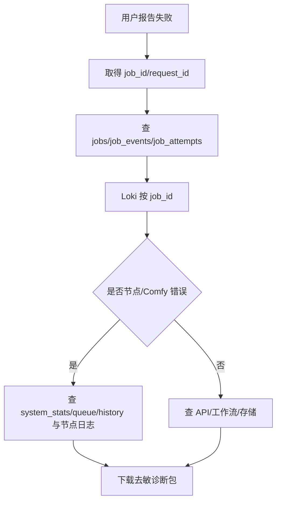

# 日志与排错

API、scheduler、ComfyUI、Docker 和 systemd 日志由每台 Alloy 发往 4090 Loki。应用日志为 JSON，并统一携带 `request_id/trace_id/job_id/tenant_id/workflow_key/workflow_version/node_id/prompt_id/attempt/event/duration_ms/error_code`；Authorization、Key、密码、Cookie 和 Secret 字段会脱敏。

Grafana Explore 示例：

```logql
{job=~".+"} | json | job_id="JOB_ID"
{job=~".+"} | json | node_id="worker-3090-a"
{job=~".+"} | json | error_code!=""
{job="gpu-control-scheduler"} | json | prompt_id="PROMPT_ID"
```



CLI：`scripts/gpuctl diagnostics job JOB_ID`。诊断包只含白名单 JSON/状态，不含 Key 与私有参数。按时间排查先确认三机 NTP。Loki 不通时本地 `docker compose logs --tail 200 SERVICE` 和 `journalctl -u gpu-node-agent --since -30min` 仍可用。

