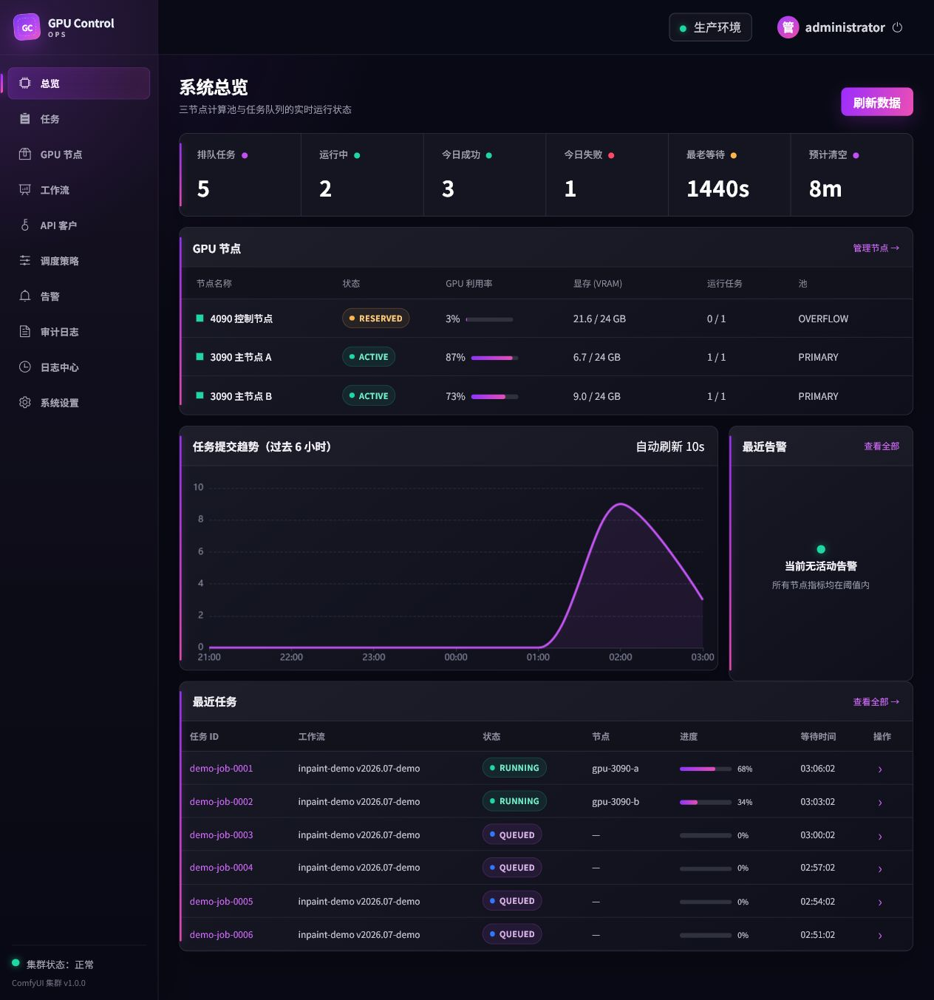

# GPU Control 单文件审计包

版本：1.0.0  
审计基线：2026-07-21 第一轮全量重构结果  
适用对象：架构、后端、运维、安全和产品第二轮审计人员  

这是一份无需解压即可阅读的审计入口。它汇总系统边界、调度规则、功能清单、关键代码位置、测试原始证据、真实网页截图、部署就绪度、已知风险和第二轮核查步骤。

审计结论：**可以进入第二轮源码与三机验收，但当前不能批准生产上线。** Windows 无 GPU 环境内可执行的后端、前端、迁移和浏览器验证已经通过；真实 Ubuntu、PostgreSQL 锁竞争、NVIDIA、ComfyUI 推理、三机日志和告警仍需实机签字。

## 阅读路径

- 第 1-16 页：一页式结论、架构、功能、安全、测试证据、网页实图和第二轮执行单。
- 第 17-26 页：核心代码、调度公式、数据库事务、状态机、恢复/取消/超时、安全算法和优先修复项。
- 第 27-39 页：4090 控制面与两台 3090 从空机开始的完整命令、联网、日志、首单、压力、备份和签字表。
- 时间有限先看第 2、4、6、16、26 和 39 页；深入审计再按顺序阅读全部内容。

状态含义：

- `PASS`：已有本轮实际执行证据。
- `CONDITIONAL`：机制和配置已实现，但缺少真实生产环境验证。
- `BLOCKED`：缺少业务材料或基础设施，生产验收不能继续。
- `REVIEW`：第二轮审计应重点检查，不代表已发现漏洞。

# 1. 一页式审计看板

| 审计域 | 当前状态 | 核心结论 | 第二轮动作 |
|---|---|---|---|
| 架构边界 | PASS | PostgreSQL 是任务真相；Redis 只做实时通知和限流 | 核对代码是否存在旁路状态 |
| 调度器 | PASS / CONDITIONAL | asyncio 专用调度器、3090 优先、4090 Guard、单节点单任务已实现；未做真实 PostgreSQL/GPU 压测 | 用三个 Fake 实例和真实 PostgreSQL 做进程级测试 |
| API 与数据库 | PASS / CONDITIONAL | API、RBAC、幂等、配额、迁移测试通过；生产 PostgreSQL 未跑 | 空 PostgreSQL 升级并验证约束和锁 |
| ComfyUI 集成 | PASS / BLOCKED | Fake 客户端链路已测；真实 workflow、模型和节点未提供 | 导入 API workflow，跑真实首单 |
| 管理后台 | PASS | Vue 页面、构建、浏览器交互、桌面和移动布局已验证 | 复核危险操作确认与权限 |
| 安全 | REVIEW | API Key、JWT、回调 SSRF、HMAC Node Agent、路径与图片校验已实现 | 做专门对抗测试和依赖审计 |
| 部署 | CONDITIONAL | 三机 Compose、脚本、UFW、Node Agent、手册齐全 | 三台空 Ubuntu 逐条执行 |
| 日志监控 | CONDITIONAL | Alloy/Loki/Prometheus/Grafana/Alertmanager 配置齐全 | 验证跨主机标签、告警触发与恢复 |
| 自动化测试 | PASS | Python 44 passed；前端 test/lint/format/build 通过 | 在 Linux、PostgreSQL 和 Docker 复跑 |
| 生产资料 | BLOCKED | IP、域名、证书、飞书、真实 workflow/model 清单缺失 | 填写 USER_INPUT_REQUIRED 并签字 |

当前最重要的判断：第一轮交付不是空目录或接口壳；核心路径有实现和本机测试。但 Fake ComfyUI 和 SQLite 只能证明逻辑可运行，不能替代真实三机与 GPU 验收。

# 2. 系统边界与三机拓扑

```text
用户/业务系统
      |
      v
4090 控制面: Nginx -> FastAPI -> PostgreSQL
                         |          ^
                         v          |
                      Redis      Scheduler
                                     |
                    +----------------+----------------+
                    |                |                |
                    v                v                v
              3090-A PRIMARY   3090-B PRIMARY   4090 OVERFLOW
                 ComfyUI          ComfyUI           ComfyUI
                    |                |                |
                    +------ WS/HTTP 进度与产物 --------+

三机 Alloy -> 4090 Loki <- Grafana
Prometheus <- API/Scheduler/Node Agent/DCGM/PostgreSQL/Redis
Alertmanager -> 飞书
```

| 主机 | 默认职责 | GPU 状态 | 对外暴露原则 |
|---|---|---|---|
| 4090 | API、Scheduler、Web、PostgreSQL、Redis、Loki、Grafana、Prometheus | `RESERVED`，默认不出图 | 只开放 Web/API/运维入口；Loki 仅工作节点可访问 |
| 3090-A | ComfyUI、Node Agent、Alloy、GPU exporter | `PRIMARY ACTIVE` | ComfyUI/Agent 只允许 4090 控制 IP |
| 3090-B | ComfyUI、Node Agent、Alloy、GPU exporter | `PRIMARY ACTIVE` | 与 3090-A 相同 |

关键架构约束：

- PostgreSQL 保存 job、event、attempt、lease、artifact 和 callback；Redis 故障不能导致任务丢失。
- Scheduler 只做数据库事务、小型 JSON、局域网上传下载和 WebSocket 监听，不执行推理。
- 每个 ComfyUI 本地最多一个由本系统提交的活动 prompt，避免提前灌满远端队列。
- ComfyUI 使用固定版本 Dockerfile 可复现构建；模型通过只读卷挂载，不放进镜像，不使用 `docker commit`。
- 没有采用 Celery/Flower。当前三节点固定拓扑需要显式租约、恢复与 4090 Guard，专用调度器更直接；该决策可在第二轮重新挑战。

# 3. 调度规则与生命周期

正常执行顺序：

```text
POSTGRES 等待任务
  -> 找到一个健康且空闲的节点
  -> 事务 SELECT ... FOR UPDATE SKIP LOCKED 领取一项
  -> 创建 attempt 与 node lease
  -> 上传 input/mask
  -> 渲染 API workflow bindings
  -> POST /prompt，只提交一个 prompt
  -> WebSocket 记录进度
  -> history 校验 + 下载产物 + SHA-256
  -> 终结状态 + 释放 lease
  -> 领取下一项
```

| 规则 | 实现意图 | 第二轮必须验证 |
|---|---|---|
| 3090 优先 | 两台 PRIMARY 节点先参与候选和打分 | 大量任务下 4090 不应被提前选中 |
| 4090 ACTIVE | 管理员明确 Release/ACTIVE 后可像普通节点执行 | 管理权限、审计日志、回滚状态 |
| 4090 OVERFLOW | 只有队列数或最长等待超过阈值才考虑 | 阈值边界与动态配置生效时间 |
| 全量 Guard | 自动开关、无人工 reserve、无 sentinel、低利用率、足够显存、允许时段均通过 | 任一条件失败都不能派发 |
| 单槽位 | 数据库 lease 限制每节点 `max_concurrency=1` | 多 scheduler/崩溃条件下没有双派 |
| 公平性 | tenant 轮转、优先级和 aging | 大租户不能长期饿死小租户 |
| 恢复 | 有 prompt_id 时先查 queue/history | scheduler 重启不能盲目重提 prompt |
| 取消/超时 | 运行中 watcher/watchdog 调用 interrupt | 状态最终必须收敛并释放 lease |

任务状态主链：

```text
QUEUED -> CLAIMED -> UPLOADING -> SUBMITTED -> RUNNING
        -> SUCCEEDED
        -> RETRY_WAIT -> QUEUED
        -> CANCELLING -> CANCELLED
        -> FAILED / TIMED_OUT
```

审计重点：状态转换必须由领域状态机约束；不能通过管理 API 任意写字符串绕过事件、attempt、lease 和审计记录。

# 4. 功能覆盖矩阵

| 模块 | 已交付能力 | 状态 |
|---|---|---|
| 公共 API | API Key、multipart 入队、幂等、配额/限流、状态、SSE、产物、取消 | PASS |
| 输入安全 | JPEG/PNG/WEBP 解码、字节/像素限制、蒙版尺寸、文件名与路径安全 | PASS |
| 回调 | HTTPS allowlist、私网拒绝、禁重定向、HMAC、指数退避、attempt | PASS / REVIEW |
| 管理 API | JWT/RBAC、Dashboard、任务、节点、工作流、客户、调度、告警、审计 | PASS |
| 节点控制 | Drain、Reserve、Release、interrupt、free model、安全 restart | PASS / CONDITIONAL |
| 工作流 | 只接收 Export Workflow (API)、schema、binding、class 白名单、模型声明 | PASS / BLOCKED |
| Scheduler | 领取、公平调度、3090 优先、4090 Guard、恢复、取消、超时 | PASS / CONDITIONAL |
| Comfy 客户端 | upload、prompt、queue/history、WS、download、interrupt、free | PASS / CONDITIONAL |
| Fake ComfyUI | 无 GPU 开发、进度、结果、取消、失败和并发模拟 | PASS |
| Web | 10 个管理页面、LiClick 风格、响应式、日志跳转 | PASS |
| 可观测性 | JSON 日志、四类关联 ID、Alloy/Loki、指标、告警和飞书 | CONDITIONAL |
| 部署运维 | gpuctl、Compose、UFW、安装、诊断、镜像/模型同步、备份回滚 | CONDITIONAL |

工作流边界：普通 ComfyUI UI 保存格式不能直接提交。生产工作流必须在 ComfyUI 使用 `Export Workflow (API)` 导出，再登记 schema、参数 bindings、模型、自定义节点、最低显存和输出节点。

# 5. 安全与故障审计

| 攻击面/故障 | 当前控制 | 第二轮验证方法 |
|---|---|---|
| API Key 泄露 | 哈希保存、禁用、过期、租户隔离 | 数据库中不能出现明文；跨租户访问应 404/403 |
| 重复请求 | `Idempotency-Key` 绑定请求摘要 | 同键同体复用；同键异体冲突 |
| 图片炸弹 | 解码、字节和像素上限 | 超大尺寸、截断文件、伪扩展名 |
| 路径穿越 | 安全文件名、受控根目录、原子写入 | `../`、绝对路径、符号链接场景 |
| Callback SSRF | HTTPS host allowlist、DNS/IP 私网拒绝、无重定向 | 127.0.0.1、RFC1918、IPv6、重绑定、3xx |
| Callback 伪造 | HMAC 时间戳签名、attempt 记录 | 修改 body/时间戳后验签失败 |
| Node Agent 冒用 | HMAC、时间窗、nonce 防重放、命令白名单 | 重放、乱序、过期签名、未知 action |
| Agent 提权 | 最小 sudoers，不挂 Docker Socket | 安装后逐条检查 sudo 可执行范围 |
| 双重派发 | advisory lock、SKIP LOCKED、唯一活动 lease | 两个 scheduler 竞争与 kill -9 |
| Redis 故障 | PostgreSQL 真相 + 周期扫描降级 | 停 Redis 后仍能入队并最终领取 |
| Scheduler 重启 | queue/history 恢复，不盲重提 | SUBMITTED/RUNNING 各阶段 kill/restart |
| 日志泄密 | 结构化日志和字段过滤意图 | 搜索 Key/JWT/password/webhook/model path |

依赖审计限制：`npm install` 显示 4 个公告（2 moderate、1 high、1 critical），但当前会话没有获准向外部服务提交依赖元数据，因此没有完成精确 `npm audit`。第二轮不得把依赖安全标记为通过。

# 6. 关键源码导航

第二轮若只做抽样，建议按以下顺序打开。这里列的是审计入口，不是让审计人员遍历全部文件。

```text
packages/gpu_control_core/repository.py
  PostgreSQL 领取、lease、attempt、恢复与持久化边界

packages/gpu_control_core/scheduling.py
  3090 优先、4090 OVERFLOW Guard、候选排序和公平性

packages/gpu_control_core/state_machine.py
  任务状态转换的唯一合法路径

apps/scheduler/src/gpu_control_scheduler/main.py
  调度循环、单主锁、执行、取消、超时和恢复编排

packages/comfy_client/client.py
  ComfyUI HTTP/WebSocket、上传、history、产物和控制操作

apps/api/src/gpu_control_api/main.py
  公共/管理 API、中间件、鉴权和错误边界

apps/node_agent/src/gpu_node_agent/main.py
  HMAC、防重放、受限节点操作

migrations/versions/20260721_0001_initial.py
  完整数据库表、索引、约束和迁移基线

apps/web/src/
  Vue 路由、状态、管理页面、危险操作交互和 LiClick 风格

deploy/control-plane/compose.yaml + deploy/gpu-node/compose.yaml + configs/ + scripts/gpuctl
  三机网络、端口、卷、健康检查、日志与运维入口
```

抽样审计问题：

- 领取任务、创建 lease 和 attempt 是否处于同一事务？
- 4090 Guard 是否在最终派发前再次检查，还是只在展示层判断？
- 恢复逻辑能否区分“远端已完成”“仍在队列”“未知”，未知时是否保守？
- 管理员危险操作是否同时有 RBAC、确认、审计日志和失败结果？
- callback 解析域名后是否验证最终连接 IP，并拒绝重定向？
- 所有服务日志是否能用 `job_id/request_id/node_id/prompt_id` 串联？

# 7. 本轮真实测试证据

以下内容来自仓库内保留的原始日志，不是计划值。

| 测试 | 实际结果 | 证据文件 |
|---|---|---|
| Python pytest | 44 passed in 17.34s | `artifacts/pytest-2026-07-21.txt` |
| Ruff | All checks passed | `artifacts/static-and-migration-2026-07-21.txt` |
| mypy strict | 22 source files 无问题 | 同上 |
| Vitest | 1 test passed | `artifacts/frontend-2026-07-21.txt` |
| ESLint | 0 warning | 同上 |
| Prettier | 全部匹配 | 同上 |
| Vite build | 2038 modules transformed | 同上 |
| Alembic | 空 SQLite 到 `20260721_0001 (head)` | 静态/迁移日志 |
| 配置与文档 | 15 YAML、2445 JSON、本地 Markdown 链接通过 | 静态/迁移日志 |
| 浏览器 | 登录、多页面、刷新、桌面/移动；console 无 error/warn | 10 张 PNG 截图与 QA 记录 |

```text
............................................ [100%]
44 passed in 17.34s

Test Files  1 passed (1)
Tests       1 passed (1)

All matched files use Prettier code style!
2038 modules transformed.
built in 3.47s

All checks passed!
Success: no issues found in 22 source files
20260721_0001 (head)
OK: 15 YAML, 2445 JSON, all local Markdown links
```

测试覆盖包括：100 并发 API 入队、API/RBAC/幂等、Redis 降级、Fake ComfyUI、调度策略、状态机、Node Agent 最小配置与防重放、回调限制、图片校验、运行中取消和超时。

# 8. 部署就绪度与已修问题

第一轮部署复查已经直接修复以下问题：

- 控制面 Docker backend 原为 `internal`，会阻止 Scheduler 访问局域网 ComfyUI；已调整为可出站 bridge，同时 PostgreSQL/Redis 仍不发布主机端口。
- Loki 原本未给两台工作节点提供入口；已绑定 4090 控制 IP 的 3100，并用 UFW 仅允许两台 3090。
- 补齐双角色 `install_node_agent.sh`；3090 使用独立最小设置，不要求数据库、JWT 或 API Secret。
- 修正 3090 UFW 文档参数、节点 inventory 导入、模型 manifest 默认路径和镜像导入导出命令。
- 增加控制面 UFW、节点 bootstrap、镜像 SHA 校验、模型远端二次 SHA 和诊断流程。

| 就绪项 | 文件/入口 | 状态 |
|---|---|---|
| 4090 控制面部署 | `deploy/control-plane/compose.yaml`、部署手册 | CONDITIONAL |
| 3090 工作节点 | `deploy/gpu-node/compose.yaml`、Node Agent 安装 | CONDITIONAL |
| NVIDIA 驱动与 Toolkit | bootstrap 脚本、逐项命令 | CONDITIONAL |
| 网络与 UFW | 双角色配置脚本 | CONDITIONAL |
| 统一运维 | `scripts/gpuctl` | CONDITIONAL |
| 镜像离线分发 | export/import + SHA | CONDITIONAL |
| 模型同步 | manifest + rsync + SHA | CONDITIONAL |
| 日志监控 | Loki/Alloy/Prometheus/Grafana | CONDITIONAL |
| 备份升级回滚 | runbook 与命令 | CONDITIONAL |

完整逐命令手册仍保留在 `docs/24_THREE_HOST_DEPLOYMENT_AND_ACCEPTANCE.md`，但本 PDF 已给出是否可上线所需的全部审计结论。

# 9. 真实网页证据：最终系统总览

这些图片来自本地实际运行的 Vue 页面和 FastAPI 演示数据，不是 Figma 或静态效果图。视觉采用参考图中的深色画布、紫粉渐变、细边框、紧凑卡片和状态胶囊，同时保持 GPU 管理后台的信息密度。



节点控制、任务、工作流、客户、调度、审计与日志页面均由同一 Vue 应用和真实 API 数据驱动；旧迭代截图在交付清理时删除，避免把渲染中间产物混入部署仓库。

# 10. 页面与移动端验证

浏览器验收覆盖系统总览、节点和调度页面；控制台无 warning/error。390×844 视口下 `scrollWidth == clientWidth`，无页面横向溢出。最终截图和 PDF 已足够用于外观审计，完整行为由前端测试和 API 集成测试复核。

# 11. 未验证项与上线阻断

| 未验证项 | 原因 | 生产影响 |
|---|---|---|
| 三台 Ubuntu 空机安装 | 当前是 Windows，无 systemd/UFW | BLOCKED：必须逐机执行并留证 |
| NVIDIA 驱动、Toolkit、DCGM | 当前无 NVIDIA GPU/Docker daemon | BLOCKED：容器 GPU 不可确认 |
| 真实 PostgreSQL 锁竞争 | 当前迁移验证使用 SQLite | BLOCKED：并发领取仍需 PostgreSQL 压测 |
| 真实 ComfyUI 推理 | workflow、模型、自定义节点未提供 | BLOCKED：无法判断质量、显存、超时 |
| 4090 OVERFLOW 实机 | 无真实 GPU 指标和队列压力 | BLOCKED：Guard 必须逐条件验收 |
| 三机 Alloy/Loki | 无三台主机 | BLOCKED：跨机日志关联未确认 |
| 飞书触发与恢复 | Webhook/Secret 未提供 | BLOCKED：告警闭环未确认 |
| 备份恢复演练 | 无生产型 PostgreSQL/卷 | BLOCKED：RPO/RTO 未签字 |
| callback 对端联调 | 域名和测试 endpoint 未提供 | CONDITIONAL：安全逻辑已测，链路未测 |
| npm 精确依赖审计 | 外部元数据权限未获准 | REVIEW：4 个公告待归因和升级 |

仍需业务方提供：三机最终 IP、域名/访问方式、TLS 证书方案、飞书 Webhook 与 Secret、ComfyUI API workflow JSON、checkpoint/VAE/LoRA/ControlNet 清单、自定义节点及版本、输入限制、保留天数、超时策略和 4090 参与条件。

不得误报：本轮没有宣称 Docker Compose、NVIDIA、真实 GPU 推理、生产 PostgreSQL、三机 Loki、飞书和灾备恢复已经通过。

# 12. 第二轮审计执行单

建议审计人员按顺序执行，任何一步失败都先修复并补测试，不只写报告。

1. 核对源码清单、锁文件、镜像 tag/commit、Secret 和异常大文件。
2. 在干净 Linux 环境复跑 Ruff、mypy、pytest、Vitest、ESLint、Prettier 和 Vite build。
3. 新建 PostgreSQL，运行 Alembic；检查索引、约束、`SKIP LOCKED` 和 advisory lock。
4. 启动 API、Scheduler、Redis、PostgreSQL 和三个 Fake ComfyUI，执行 100 并发、取消、超时、失败重试。
5. 同时启动两个 Scheduler，并在 CLAIMED/SUBMITTED/RUNNING 阶段 kill -9，检查双派、恢复和 lease 回收。
6. 逐项打破 4090 Guard：reserve、sentinel、利用率、显存、时段和阈值，确认始终拒绝派发。
7. 对 API Key、JWT/RBAC、幂等、图片炸弹、路径穿越、callback SSRF/HMAC 和 Agent 重放做对抗测试。
8. 执行 `docker compose config`，检查端口、volume、network、healthcheck、只读挂载和日志驱动。
9. 三台 Ubuntu 从空机部署，验证 NVIDIA 容器、UFW、Node Agent、ComfyUI、Alloy、Prometheus targets。
10. 导入真实 API workflow 和模型清单，完成首单、并发、取消、模型释放和 ComfyUI 安全重启。
11. 通过四类 ID 在 Loki 串联一次任务；触发和恢复飞书告警；下载诊断包。
12. 做 PostgreSQL/配置备份恢复和版本回滚，记录 RPO/RTO、命令输出与负责人签字。

最终签字建议：

| 决策 | 当前值 |
|---|---|
| 第一轮工程交付是否存在可执行实现 | 是 |
| 是否可进入第二轮源码与可靠性审计 | 是 |
| 是否已完成真实三机验收 | 否 |
| 是否已完成真实业务工作流验收 | 否 |
| 是否批准生产上线 | 否，完成所有 BLOCKED 项后再决定 |

# 13. 审计证据索引

如果第二轮需要从这份 PDF 深入到原始证据，只需查看下面几类文件，不必遍历整个仓库。

```text
docs/IMPLEMENTATION_STATUS.md
docs/24_THREE_HOST_DEPLOYMENT_AND_ACCEPTANCE.md
docs/USER_INPUT_REQUIRED.md

artifacts/pytest-2026-07-21.txt
artifacts/frontend-2026-07-21.txt
artifacts/static-and-migration-2026-07-21.txt
artifacts/screenshots/gpu-control-*.png

packages/gpu_control_core/repository.py
packages/gpu_control_core/scheduling.py
packages/gpu_control_core/state_machine.py
apps/scheduler/src/gpu_control_scheduler/main.py
packages/comfy_client/client.py
apps/api/src/gpu_control_api/main.py
apps/node_agent/src/gpu_node_agent/main.py
migrations/versions/20260721_0001_initial.py
deploy/control-plane/compose.yaml
deploy/gpu-node/compose.yaml
scripts/gpuctl
```

本文件的目标是让第一遍审计只打开一个 PDF 就能判断“做了什么、测了什么、没测什么、下一步查哪里”。需要确认具体漏洞或实现质量时，再按本页列出的关键入口进行源码抽样和实机验证。
